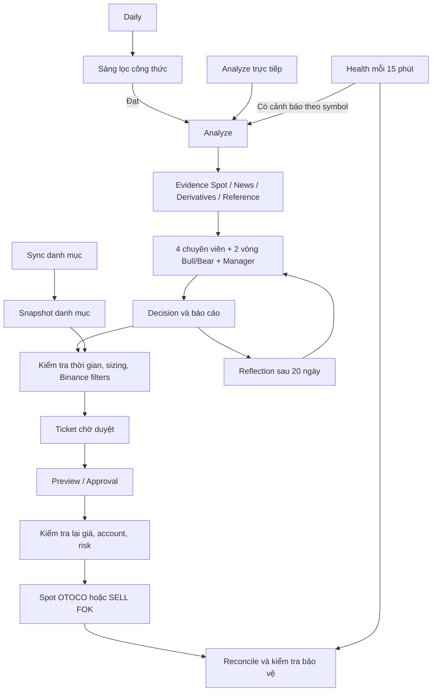

# Rà soát thuật toán, luồng và cơ hội feature — 16/09/2026

Ưu tiên đề xuất: làm đúng luồng dữ liệu và bảo vệ vị thế, bổ sung khả năng giải thích vì sao có/không có ticket, rồi mới đo và cải thiện chiến lược. Repo đã có bộ khung research → phê duyệt → execution tương đối đầy đủ; phần còn thiếu đáng kể là đo hiệu quả sau chi phí và quan sát trạng thái xuyên suốt.

## Phạm vi và bằng chứng

- Rà soát working tree hiện tại, bao gồm các thay đổi chưa commit của người dùng. Không sửa mã ứng dụng, cấu hình hoặc dữ liệu vận hành.
- Đọc các module Python về data, screener, committee, risk, service, broker, execution, store, dashboard, dispatcher, runner; đối chiếu command queue, preview/confirm và dashboard web.
- Chạy offline: **249 test Python pass**, **35 test unit web pass**. Web unit được chạy bằng Node 22 trực tiếp vì lần gọi qua npm gặp runtime không hỗ trợ `--experimental-strip-types`.
- Tái hiện riêng sáu trường hợp bằng fixture và SQLite tạm; kết quả ở bảng bên dưới. Không gọi API giao dịch.
- Chưa chạy E2E Binance hoặc toàn bộ web build/integration trong lần rà soát này. Test pass hiện tại không bao phủ hết các lỗi đã tái hiện.
- Đọc 259 `decision.json` cục bộ, nằm trong các thư mục ngày 17–19/07, 23/07 và 16/09/2026: 248 `NO_TRADE`, 6 `HOLD`, 5 `ACCUMULATE`; 224 báo lỗi evidence từ tương lai. Đây là lịch sử có thể thuộc nhiều phiên bản, **không phải tỷ lệ lỗi đo riêng cho working tree hiện tại**.
- Trong 29 artifact có model-call log, thời gian từ request đầu đến response cuối có median 129,22 giây, max 327,27 giây; một run vượt 300 giây. Số liệu gộp cả run lỗi và run thành công, không phải benchmark chuẩn hóa.

## Các luồng đang có



- `daily`: refresh reflection → screen → analyze những symbol pass → đánh dấu bucket hoàn tất. `analyze` trực tiếp và phân tích từ health **không đi qua screener**, nên ngưỡng volume/spread/momentum của screener không phải điều kiện chung của mọi đường tạo ticket.
- Research: bốn chuyên viên technical/liquidity/news/derivatives; hai vòng Bull/Bear; manager kết luận. Thông thường có chín lời gọi LLM tuần tự, chưa tính retry. Schema và evidence ID được kiểm tra; `conviction` là điểm do LLM sinh, chưa được hiệu chỉnh thành xác suất thành công.
- Risk: sizing bằng Decimal, giới hạn từng lệnh/từng coin/tổng danh mục/reserve, làm tròn theo Binance filters; bộ risk không phụ thuộc việc LLM tự tính khối lượng.
- Execution: BUY dùng OTOCO với entry LIMIT FOK; REDUCE/EXIT hủy protection rồi SELL FOK và phục hồi protection khi cần. Có client ID cố định theo ticket và reconcile khi kết quả không chắc chắn.
- Web: command → D1 queue → outbound runner → dispatcher → SQLite journal → kết quả → publish dashboard. Execution trên web chỉ cho Testnet, có preview/fingerprint và xác nhận. Mainnet có đường Telegram riêng.
- Dashboard poll snapshot mỗi 30 giây. Poll thành công không đồng nghĩa giá/evidence được lấy mới mỗi 30 giây; nguồn mới phụ thuộc sync/analyze/health/publish.

Nguồn chính: [service.py](/home/bao_quoc/crypto-desk-rewrite/src/crypto_desk/service.py:65), [committee.py](/home/bao_quoc/crypto-desk-rewrite/src/crypto_desk/committee.py:406), [execution.py](/home/bao_quoc/crypto-desk-rewrite/src/crypto_desk/execution.py:118), [runner.py](/home/bao_quoc/crypto-desk-rewrite/src/crypto_desk/runner.py:205).

## Thuật toán hiện tại và giới hạn

**Screener.** Bộ lọc yêu cầu volume 24h ≥ 50 triệu USDT, spread ≤ 0,2%, ít nhất 90 daily closes, momentum 20 ngày dương và evidence không stale. Công thức:

```text
m20 = close_latest / close_20_days_ago - 1
m60 = close_latest / close_60_days_ago - 1
volume_score = min(1, quote_volume / 500_000_000)
score = 0.45*m20 + 0.25*m60 + 0.20*volume_score - 0.10*spread
```

Volume trên 500 triệu đều bão hòa thành 1; thành phần spread tối đa chỉ 0,0002 sau filter, trong khi volume có thể đóng góp 0,2. Các trọng số danh nghĩa không phản ánh tỷ trọng thực tế vì feature khác thang đo. Biến `normalized_log_volume` thực tế là phép chia tuyến tính có chặn, không phải logarithm. Chưa có bằng chứng backtest cho thấy cách xếp hạng này tạo lợi thế; không nên tự đổi trọng số trước khi đo. Xem [screener.py:56](/home/bao_quoc/crypto-desk-rewrite/src/crypto_desk/screener.py:56).

**Sizing.** Notional bị giới hạn bởi giá trị nhỏ nhất của `risk_budget / stop_distance_fraction`, phần room từng coin, room tổng danh mục và USDT reserve; Mainnet giai đoạn đầu còn có cap. Công thức hiện chưa tính fee/slippage vào mức lỗ tại stop; chưa có ngân sách tổng lỗ tại stop cho nhiều vị thế hay daily drawdown gate. `conviction` không tham gia sizing. Xem [risk.py:78](/home/bao_quoc/crypto-desk-rewrite/src/crypto_desk/risk.py:78).

**Đánh giá sau quyết định.** Reflection tính biến động giá từ giá tham chiếu tới daily close sau khoảng 20 ngày; chưa mô phỏng khớp entry, thứ tự chạm stop/target hoặc phí. `realized_return` hiện không phải PnL đã chốt của giao dịch thực tế. MAE/MFE chỉ lấy close nên không phản ánh cực trị intraday. Benchmark dùng close đầu trong chuỗi làm gốc, khác mốc vào của symbol. Xem [service.py:313](/home/bao_quoc/crypto-desk-rewrite/src/crypto_desk/service.py:313) và [service.py:728](/home/bao_quoc/crypto-desk-rewrite/src/crypto_desk/service.py:728).

## Những điểm cần sửa trước khi mở rộng

P0 ở đây là thứ tự đề xuất cho đợt công việc tiếp theo, không phải phân loại sự cố production.

| Ưu tiên | Phát hiện đã tái hiện offline | Tác động và hướng xử lý |
|---|---|---|
| P0 | `daily` đặt cutoff 00:15, gọi `build(..., live=False)` nhưng `exchange_info` gán `as_of` bằng thời điểm fetch hiện tại. Chỉ cần fetch sau cutoff 1 giây, screen bị chặn vì evidence từ tương lai; kết quả vẫn `COMPLETED`, gọi lại thành `ALREADY_DONE`. | Phân biệt ngày chạy lịch, cutoff nến và thời điểm snapshot live. Replay lịch sử phải dùng dữ liệu đã lưu đúng thời điểm. Lỗi nguồn cần trạng thái có thể retry, khác với quyết định chiến lược không giao dịch. Nhánh `health → analyze(symbol, now)` cũng truyền cutoff tường minh nên đi vào cùng chế độ kiểm tra. |
| P0 | Vị thế chỉ có một SELL LIMIT rất nhỏ, không có stop-loss, vẫn không sinh `missing_protection`. | Kiểm tra loại lệnh stop, trạng thái hoạt động và tổng khối lượng thực sự được bảo vệ; không chỉ kiểm tra có SELL cùng symbol. |
| P0 | Extended derivatives được đọc sau vòng kiểm tra timestamp. Fixture có long/short ratio ở ngày kế tiếp vẫn được nhận, đồng thời evidence hiển thị timestamp cũ của open interest. | Lưu nguồn/timestamp riêng cho từng chỉ số; áp dụng cutoff và freshness trước khi tổng hợp. Khi thiếu funding history, dùng `unknown`, tránh mặc định `stable`. |
| P1 | Futures setup entry=100, stop=95, target=110 vẫn chấp nhận `risk_reward_ratio=99`, dù reward/risk từ mức giá bằng 2. | Tính R:R trong code từ giá; dùng một quy ước rõ ràng về reward/risk và tính lại sau rounding/cost. Không lấy con số LLM nhập làm giá trị chuẩn. |
| P1 | Một `NO_TRADE` do `provider:quota`, có evidence IDs, trở thành `latest_valid_run` và thay thế quyết định hợp lệ trước đó. | Thêm trạng thái run riêng: thành công, lỗi dữ liệu, lỗi provider, output không hợp lệ. `NO_TRADE` có lý do chiến lược vẫn có thể là quyết định hợp lệ; lỗi kỹ thuật phải là attempt lỗi. |
| P1 | EXIT trên vị thế có hai protection lists trả `ticket_id=None`. | Mua thêm có thể tạo nhiều OTOCO, nhưng đường bán chỉ nhận đúng một list. Cần quản lý theo lot/chain hoặc kế hoạch hủy nhiều protection lists có reconcile; trước mắt hiển thị lý do bị chặn và hướng xử lý. |

Nguồn: [daily](/home/bao_quoc/crypto-desk-rewrite/src/crypto_desk/service.py:215), [future check](/home/bao_quoc/crypto-desk-rewrite/src/crypto_desk/data.py:383), [protection check](/home/bao_quoc/crypto-desk-rewrite/src/crypto_desk/service.py:369), [extended derivatives](/home/bao_quoc/crypto-desk-rewrite/src/crypto_desk/data.py:463), [R:R validation](/home/bao_quoc/crypto-desk-rewrite/src/crypto_desk/committee.py:146), [latest valid run](/home/bao_quoc/crypto-desk-rewrite/src/crypto_desk/store.py:215), [sell ticket](/home/bao_quoc/crypto-desk-rewrite/src/crypto_desk/service.py:521).

Ngoài sáu trường hợp trên, `_create_ticket` trả `None` cho nhiều nguyên nhân mà không đưa lý do vào kết quả analyze: portfolio quá 5 phút, hết room, unpriced assets, giá không đúng tick hoặc protection không phù hợp. Một lượt LLM kéo dài hơn 5 phút cũng vượt cửa sổ tạo ticket. Đây là điểm đứt trải nghiệm rõ nhất giữa khuyến nghị và hành động. Xem [service.py:467](/home/bao_quoc/crypto-desk-rewrite/src/crypto_desk/service.py:467).

## Feature nên làm theo thứ tự

| Thứ tự | Feature | Bản nhỏ nhất hữu ích | Điều kiện nghiệm thu |
|---|---|---|---|
| 1 | **Decision trace — Vì sao có/không có lệnh?** | Một thẻ nối research run → decision → risk checks → ticket → execution. Hiển thị `blocked_reason`, tuổi dữ liệu, room giới hạn, ticket TTL và bước tiếp theo. Tái sử dụng artifact, ticket và `SizingResult.rooms`. | Mọi `ACCUMULATE/REDUCE/EXIT` không có ticket đều có mã lý do. Người dùng phân biệt HOLD, không có setup và lỗi hạ tầng. Lỗi provider không ghi đè khuyến nghị hợp lệ. |
| 2 | **Data & protection monitor** | Trạng thái từng nguồn/chỉ số, mốc dữ liệu, lần fetch, lần lỗi; từng vị thế có protected quantity và uncovered quantity. Báo khi trạng thái đổi, gộp cảnh báo trùng. | Không báo an toàn khi chỉ có limit sell hoặc stop bảo vệ thiếu lượng; metric tương lai/stale không vào evidence; chỉ rõ snapshot mới nhưng dữ liệu bên trong cũ. |
| 3 | **Paper trading + nhật ký hiệu quả** | Đánh giá các quyết định đã lưu với cùng logic risk; mô phỏng entry/stop/target, fee/slippage và trường hợp không khớp. Nối `run_id → ticket_id → fills`, lưu phiên bản chiến lược/prompt/model. | Báo net PnL, drawdown, expectancy, số mẫu, tỷ lệ không khớp, so sánh baseline. Tách forward price return với PnL thực. Quy định rõ trường hợp stop và target cùng nằm trong một bar. |
| 4 | **Risk preview sau chi phí** | Tái dùng hàm sizing để hiển thị quantity, lỗ tại stop dự kiến, reward/risk tính bằng code, fees, slippage và phân bổ sau lệnh. Bổ sung tổng stop-risk và daily loss gate sau khi có ledger. | Mọi con số trên thẻ được tính lại sau rounding. Dùng chi phí giả định công khai nếu chưa có commission account; không diễn giải stop-loss là bảo đảm mức lỗ tuyệt đối. |
| 5 | **Screener giải thích được** | Hiển thị momentum 20/60 ngày, volume, spread và đóng góp từng thành phần; phân biệt kiểm tra bắt buộc của execution với điều kiện riêng của screener. | Người dùng biết symbol pass/fail vì gì. Chỉ điều chỉnh normalization/trọng số sau replay và đánh giá ngoài mẫu, so sánh với công thức hiện tại. |
| 6 | **Phân tích theo sự kiện và trạng thái từng bước** | Theo dõi điều kiện vô hiệu có cấu trúc, giá gần stop/target, OI/funding vượt ngưỡng; cooldown để tránh gọi LLM lặp. Hiển thị giai đoạn data/analysts/debate/manager/risk đang chạy và thời gian mỗi giai đoạn. | Một sự kiện không tạo nhiều phân tích/ticket trùng. Đo được latency và tỷ lệ ticket hết thời gian. Có thể thử chạy song song bốn chuyên viên độc lập sau khi kiểm tra quota, giữ thứ tự debate. |
| 7 | **Order updates realtime** | Nhận account/order events, cập nhật fills/protection và journal nhanh; giữ REST reconcile để phục hồi khi mất kết nối. | Reconnect không mất/trùng fill; trạng thái thiếu protection được phát hiện mà không chờ health kế tiếp. |

Binance cung cấp `executionReport` cho cập nhật order và sự kiện order-list để hỗ trợ feature thứ 7; payload cũng có khối lượng khớp và commission. Có thể tận dụng luồng chính thức này thay vì tăng tần suất polling toàn bộ account. Nguồn: [Binance User Data Streams](https://github.com/binance/binance-spot-api-docs/blob/master/user-data-stream.md).

Ba feature đầu tiên có giá trị trực tiếp nhất: người dùng biết hệ thống đang kẹt ở đâu, thấy vị thế có được bảo vệ đủ không, và có dữ liệu để đánh giá chiến lược. Chúng tận dụng nhiều thành phần đã có, không cần đổi stack.

## Đối chiếu kế hoạch intraday đã tồn tại

[Kế hoạch short-term investing](/home/bao_quoc/crypto-desk-rewrite/docs/superpowers/plans/2026-07-18-short-term-investing.md:1) đang ghi **Proposed — chưa triển khai**. Tài liệu đã có breakout deterministic, dữ liệu 1m/5m/15m, backtest, paper, chi phí và rollout theo giai đoạn. Vì vậy intraday không phải đề xuất mới của lần rà soát này.

Đề nghị triển khai phần data + replay/paper + metrics trước và dùng kết quả để quyết định bước tiếp theo. Hướng Margin/SHORT và tự động thực thi phụ thuộc thêm vào ledger, protection recovery và các gate đã nêu trong kế hoạch. Hiện chưa có bằng chứng trong phần triển khai được rà soát để kết luận chiến lược mới hoặc committee hiện tại có lợi thế sau chi phí.

Thứ tự công việc cụ thể: sửa ba vấn đề P0 → Decision trace và phân loại run status → paper/journal cùng risk preview → cải thiện screener, latency và event updates dựa trên số liệu.
