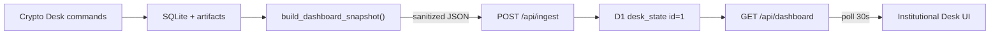

# Realtime Read-only Dashboard API Implementation Plan

> **For agentic workers:** thực hiện tuần tự theo checkbox (`- [ ]`). Mỗi task phải kết thúc bằng test liên quan xanh trước khi chuyển task tiếp theo. Không deploy nếu migration, secret audit hoặc contract tests chưa pass.

**Goal:** Thay dữ liệu hard-code trong Institutional Desk bằng dữ liệu thật từ Crypto Desk, tự động xuất bản sau mỗi thay đổi vận hành và xuất hiện trên UI private trong tối đa 30 giây, đồng thời không đưa SQLite, Binance, Gemini, Telegram credentials hoặc dữ liệu approval nhạy cảm ra trình duyệt.

**Architecture:** SQLite và artifacts trên máy chạy Crypto Desk tiếp tục là nguồn dữ liệu gốc. Một Python snapshot builder tạo payload `dashboard.v1` đã tổng hợp và lọc; publisher dùng `httpx` đẩy payload qua endpoint ingest được bảo vệ bởi Sites SIWC bypass token và một ingest secret riêng. Sites lưu đúng một snapshot mới nhất trong D1. UI gọi `GET /api/dashboard` cùng origin mỗi 30 giây, giữ last-good state trong bộ nhớ và hiển thị trạng thái stale/offline khi publisher ngừng cập nhật.

**Tech Stack:** Python 3.12, sqlite3, Pydantic v2, HTTPX, Typer, pytest, Ruff; vinext/React 19/TypeScript, Cloudflare D1, Drizzle migration, Sites private hosting. Không thêm dependency mới.

## Product decisions

- “Realtime” trong V1 nghĩa là dữ liệu mới xuất hiện trên UI trong vòng 30 giây sau khi một lệnh `sync`, `analyze`, `daily`, `health` hoặc execution mutation hoàn tất.
- Nguồn gốc chỉ cập nhật khi Crypto Desk thực sự chạy. Polling nhanh hơn không làm giá mới hơn nếu chưa có `sync` hoặc `health` mới.
- UI poll 30 giây; chưa dùng WebSocket, SSE, Durable Objects hoặc queue.
- D1 chỉ giữ snapshot mới nhất. Không xây time-series/history API trong V1.
- Site giữ chế độ private. Người xem vẫn phải đăng nhập đúng ChatGPT workspace.
- Publisher là best-effort khi được gọi tự động: publish lỗi không được làm hỏng analysis, health hoặc execution đã thành công.
- Lệnh `desk publish-dashboard` chạy thủ công ở chế độ strict và phải trả non-zero nếu publish thất bại.
- Mọi giá trị tiền/giá trong Python và JSON contract là chuỗi decimal. Frontend chỉ chuyển sang `number` tại lớp format hiển thị.
- Trường không có dữ liệu thật dùng `null`/`N/A`; không giữ signal score hoặc market change đang hard-code trong UI.

## Global constraints

- Không cho browser đọc file SQLite, artifact path, `.env`, Binance API, Gemini API hoặc Telegram API.
- Không gửi raw 444 testnet positions. Chỉ gửi configured symbols và tổng hợp external/unpriced.
- Không gửi approval actor, Telegram user/chat ID, confirmation code, client order ID, raw order payload hoặc report directory.
- Không commit SIWC bypass token hoặc ingest token. `.env.example` chỉ có placeholder rỗng.
- `POST /api/ingest` phải qua hai lớp:
  1. `OAI-Sites-Authorization: Bearer <SIWC_BYPASS_TOKEN>` do Sites kiểm tra trước Worker.
  2. `Authorization: Bearer <CRYPTO_DESK_INGEST_TOKEN>` do route kiểm tra.
- `GET /api/dashboard` không có CORS và chỉ phục vụ same-origin private site.
- Payload ingest tối đa 64 KiB; đúng `Content-Type: application/json`; `schema_version` phải bằng `1`.
- UI không xóa last-good snapshot khi request mới lỗi.
- Health scheduler hiện chạy mỗi 15 phút: snapshot được coi stale sau 20 phút và offline sau 60 phút.
- Root Python repo và `web/` là hai Git repositories riêng. Commit Python ở repo root; commit/deploy site từ `web/`. Không `git add web/` vào repo root.
- Baseline cần ghi lại trước khi sửa: toàn bộ Python tests hiện tại pass; `web/npm test` pass; Sites version 1 đang deploy private.

## Data flow



## Dashboard contract V1

Payload canonical:

```json
{
  "schema_version": 1,
  "generated_at": "2026-07-18T06:30:00+00:00",
  "environment": "testnet",
  "health": {
    "runner_state": "online",
    "research_state": "degraded",
    "last_health_at": "2026-07-18T06:15:12+00:00",
    "stale_after_seconds": 1200,
    "alerts": ["research_freshness:BTCUSDT"]
  },
  "portfolio": {
    "as_of": "2026-07-18T06:15:10+00:00",
    "nav_usdt": "318790.68916948",
    "free_usdt": "10000.00000000",
    "gross_exposure_usdt": "308790.68916948",
    "deployed_pct": "96.8637",
    "open_orders_count": 0,
    "configured_positions": [
      {
        "symbol": "BTCUSDT",
        "asset": "BTC",
        "quantity": "1.00000000",
        "mark_usdt": "63963.28500000",
        "value_usdt": "63963.28500000",
        "share_pct": "20.0656"
      }
    ],
    "external_assets_count": 414,
    "external_value_usdt": "251964.46416948",
    "unpriced_assets_count": 26
  },
  "symbols": [
    {
      "symbol": "BTCUSDT",
      "mark_usdt": "63963.28500000",
      "change_24h_pct": null,
      "position_share_pct": "20.0656",
      "latest_attempt": {
        "run_id": "fe7931ad-244c-437e-8e47-82d6dd28b1f8",
        "cutoff": "2026-07-18T05:45:23+00:00",
        "state": "blocked",
        "reason": "binance evidence is from the future"
      },
      "latest_valid_decision": {
        "run_id": "9b2d94ad-874d-436f-9879-e002c67730a0",
        "cutoff": "2026-07-18T05:14:11+00:00",
        "action": "HOLD",
        "conviction": "7",
        "bull_case": "...",
        "bear_case": "...",
        "catalysts": ["..."],
        "invalidation": "...",
        "entry": null,
        "stop": "62290",
        "target": "70000"
      }
    }
  ],
  "operations": {
    "tickets_total": 0,
    "tickets_actionable": 0,
    "orders_total": 0,
    "orders_open": 0,
    "recent_events": [
      {
        "kind": "health",
        "at": "2026-07-18T06:15:12+00:00",
        "summary": "Health bucket completed"
      }
    ]
  }
}
```

Contract rules:

- `symbols` luôn có đúng configured allowlist theo thứ tự trong `Settings.symbols`.
- `latest_valid_decision` hợp lệ khi decision có ít nhất một `evidence_id`; action có thể là `NO_TRADE` nếu committee thật sự trả action đó với evidence hợp lệ.
- `latest_attempt.state` là `valid` khi có evidence, ngược lại là `blocked` và giữ reason an toàn đã có trong database.
- `change_24h_pct` là `null` cho tới khi repository lưu được nguồn 24h đáng tin cậy; không đọc ngược artifacts chỉ để tạo số đẹp.
- `configured_positions` chỉ chứa BTC/ETH/BNB/SOL đang có balance dương.
- External positions chỉ được tổng hợp count/value; tên asset lạ không ra UI.
- `recent_events.summary` là enum/copy do code sở hữu, không nhét raw exception hoặc raw payload.
- `run_id` có thể hiển thị để trace nhưng không gửi `report_dir`.

---

### Task 0: Baseline, repository boundaries và secret audit

**Files:** không sửa product file.

**Produces:** baseline có thể so sánh và rollback; xác nhận hai Git roots sạch/dirty rõ ràng trước implementation.

- [ ] **Step 1: Ghi lại status của root và web repositories**

Run:

```bash
git status --short
git -C web status --short
git -C web rev-parse HEAD
```

Expected: không có thay đổi bất ngờ trong `web/`; mọi thay đổi root hiện hữu được ghi nhận và không bị reset.

- [ ] **Step 2: Chạy baseline Python**

Run:

```bash
uv run pytest -q
uv run ruff check .
uv run ruff format --check .
```

Expected: toàn suite và lint pass trước khi thêm dashboard API.

- [ ] **Step 3: Chạy baseline web**

Run:

```bash
cd web
PATH="$HOME/.nvm/versions/node/v22.22.0/bin:$PATH" npm test
```

Expected: build và test Institutional Desk hiện tại pass.

- [ ] **Step 4: Audit secret hiện tại**

Run từ root:

```bash
git check-ignore -v .env config.yaml data/crypto_desk.sqlite3
rg -n "(BINANCE|GEMINI|OPENAI|TELEGRAM|BYPASS|INGEST).*(=|:)" \
  .env.example config.example.yaml web/.openai web/app web/db src tests
```

Expected: local secret/database bị ignore; tracked files không chứa giá trị credential thật.

Không commit Task 0.

---

### Task 1: Store queries và Python dashboard contract

**Files:**

- Create: `src/crypto_desk/dashboard.py`
- Modify: `src/crypto_desk/store.py`
- Create: `tests/test_dashboard.py`
- Modify: `tests/test_domain_store.py`

**Interfaces:**

- Produces: `DashboardSnapshot` Pydantic model.
- Produces: `build_dashboard_snapshot(settings, store, *, now=utcnow) -> DashboardSnapshot`.
- Produces: `Store.latest_valid_run(symbol)`, `Store.latest_scheduled_run(kind)`, `Store.recent_order_events(limit)`.

- [ ] **Step 1: Viết Store tests fail**

Thêm test cho các trường hợp:

1. latest attempt bị block nhưng `latest_valid_run` vẫn trả run cũ có `evidence_ids`.
2. legitimate `NO_TRADE` có evidence vẫn được xem là valid.
3. không có valid run trả `None`.
4. latest scheduled health chọn theo `completed_at`, không dựa vào rowid.
5. recent events không trả raw payload.

Run:

```bash
uv run pytest tests/test_domain_store.py -q
```

Expected: FAIL vì methods chưa tồn tại.

- [ ] **Step 2: Thêm Store methods tối thiểu**

Không thay schema local SQLite. Query existing tables:

```python
def latest_valid_run(self, symbol: str) -> dict[str, Any] | None:
    # Iterate newest first and accept the first decision with evidence_ids.

def latest_scheduled_run(self, kind: str) -> dict[str, str] | None:
    # SELECT kind,bucket,completed_at ORDER BY completed_at DESC LIMIT 1.

def recent_order_events(self, limit: int = 5) -> list[dict[str, str]]:
    # Return ticket_id/status/event_time only; omit payload.
```

Use `json_extract(decision, '$.evidence_ids')` only if SQLite JSON1 behavior is covered by tests; otherwise parse a small bounded result set in Python. Prefer the simpler tested path.

- [ ] **Step 3: Viết dashboard serializer tests fail**

Fixtures phải cover:

- snapshot có BTC/ETH và external assets;
- 26 unpriced assets được count nhưng tên không xuất hiện;
- NAV/gross/deployed percentage dùng `Decimal`;
- latest blocked attempt + latest valid fallback cùng tồn tại;
- không có snapshot;
- không có research cho BNB/SOL;
- health chưa từng chạy;
- payload serialized không chứa forbidden keys.

Forbidden key assertion recursive:

```python
FORBIDDEN_KEY_FRAGMENTS = {
    "api_key",
    "api_secret",
    "token",
    "telegram",
    "actor",
    "confirmation",
    "report_dir",
    "client_order_id",
    "payload",
}
```

Không cấm key top-level D1 `payload` ở phía web; assertion này chỉ áp dụng object dashboard trước khi transport.

- [ ] **Step 4: Implement Pydantic models và builder**

Trong `dashboard.py`, model tất cả fields rõ ràng, `extra="forbid"`. Không trả generic `dict[str, Any]` ở boundary chính.

Builder:

1. đọc latest environment snapshot;
2. tính gross = `max(nav - free, 0)`;
3. chỉ materialize positions thuộc `Settings.symbols`;
4. aggregate external valued positions;
5. count unpriced;
6. lấy latest attempt + latest valid cho từng symbol;
7. derive health freshness từ `latest_scheduled_run("health")`;
8. lấy ticket/submission/event counts;
9. trả `DashboardSnapshot`.

Không mở artifacts để tính `change_24h_pct` trong V1.

- [ ] **Step 5: Chạy tests + lint**

Run:

```bash
uv run pytest tests/test_dashboard.py tests/test_domain_store.py -q
uv run ruff check src/crypto_desk/dashboard.py src/crypto_desk/store.py tests/test_dashboard.py
uv run ruff format --check src/crypto_desk/dashboard.py src/crypto_desk/store.py tests/test_dashboard.py
```

Expected: pass.

- [ ] **Step 6: Commit root**

```bash
git add src/crypto_desk/dashboard.py src/crypto_desk/store.py \
  tests/test_dashboard.py tests/test_domain_store.py
git commit -m "feat: build sanitized dashboard snapshots"
```

---

### Task 2: Publisher, CLI command và automatic hooks

**Files:**

- Modify: `src/crypto_desk/dashboard.py`
- Modify: `src/crypto_desk/cli.py`
- Modify: `.env.example`
- Modify: `tests/test_dashboard.py`
- Modify: `tests/test_service_cli.py`

**Interfaces:**

- Produces: `publish_dashboard(snapshot, *, url, ingest_token, sites_bypass_token, client=None) -> None`.
- Produces: CLI `desk publish-dashboard`.
- Consumes env:
  - `CRYPTO_DESK_DASHBOARD_INGEST_URL`
  - `CRYPTO_DESK_DASHBOARD_INGEST_TOKEN`
  - `CRYPTO_DESK_SITES_BYPASS_TOKEN`

- [ ] **Step 1: Viết publisher tests fail với `httpx.MockTransport`**

Assert request:

```text
POST <CRYPTO_DESK_DASHBOARD_INGEST_URL>
Content-Type: application/json
Authorization: Bearer <ingest token>
OAI-Sites-Authorization: Bearer <SIWC bypass token>
```

Cover:

- 204/200 thành công;
- 401/403 báo authentication failure không log token;
- timeout/network error không chứa URL query/secret trong message;
- payload >64 KiB bị chặn local trước request;
- thiếu một trong ba env values làm explicit CLI command fail rõ ràng.

- [ ] **Step 2: Implement publisher**

Rules:

- timeout tổng 10 giây;
- một request, không retry trong cùng command;
- `follow_redirects=False` để không forward auth headers sang host khác;
- `raise_for_status()` nhưng normalize exception thành safe category;
- serialize bằng `model_dump(mode="json")` qua UTF-8 compact JSON;
- không log response body từ remote ingest.

- [ ] **Step 3: Thêm CLI command strict**

```python
@app.command("publish-dashboard")
def publish_dashboard_command(ctx: typer.Context) -> None:
    settings = _load(ctx)
    store = Store(settings.database)
    snapshot = build_dashboard_snapshot(settings, store)
    publish_dashboard_from_env(snapshot, strict=True)
    _emit(ctx, {"status": "PUBLISHED", "generated_at": snapshot.generated_at})
```

Đảm bảo `store.close()` trong `finally`.

- [ ] **Step 4: Thêm best-effort hook sau mutation commands**

Tạo đúng một helper trong `cli.py`:

```python
def _publish_dashboard_if_configured(settings: Settings) -> None:
    # URL absent => no-op.
    # Configured but request fails => concise stderr warning; do not raise.
```

Gọi sau khi state mutation thành công:

- `sync`
- `analyze`
- `daily` khi status thực sự completed
- `health` khi status thực sự completed
- `approve`
- `reject`
- `orders --reconcile` nếu có reconcile result

Không gọi sau `doctor`, `screen`, `tickets`, `reflections` read-only.

Không nhét network side effect vào `_emit`; `_emit` tiếp tục chỉ format output.

- [ ] **Step 5: Cập nhật `.env.example`**

```dotenv
CRYPTO_DESK_DASHBOARD_INGEST_URL=
CRYPTO_DESK_DASHBOARD_INGEST_TOKEN=
CRYPTO_DESK_SITES_BYPASS_TOKEN=
```

Không thêm token mẫu có vẻ hợp lệ.

- [ ] **Step 6: Chạy tests + full root suite**

```bash
uv run pytest tests/test_dashboard.py tests/test_service_cli.py -q
uv run pytest -q
uv run ruff check .
uv run ruff format --check .
```

Expected: pass; existing JSON CLI output không đổi trừ command mới.

- [ ] **Step 7: Commit root**

```bash
git add .env.example src/crypto_desk/dashboard.py src/crypto_desk/cli.py \
  tests/test_dashboard.py tests/test_service_cli.py
git commit -m "feat: publish dashboard snapshots after desk updates"
```

---

### Task 3: D1 singleton state và migration

**Files (web repository):**

- Modify: `web/.openai/hosting.json`
- Modify: `web/db/schema.ts`
- Create: `web/db/dashboard.ts`
- Generate: `web/drizzle/<generated-dashboard-migration>.sql`

**Interfaces:**

- D1 binding: `DB`.
- Produces: `readDashboardState()`, `writeDashboardState(snapshot)`.

- [ ] **Step 1: Bật logical D1 binding**

`web/.openai/hosting.json`:

```json
{
  "project_id": "appgprj_6a5b1505ec3c81918c30c6f119177729",
  "d1": "DB",
  "r2": null
}
```

Không thêm real database ID vào file.

- [ ] **Step 2: Định nghĩa schema**

`web/db/schema.ts`:

```ts
export const deskState = sqliteTable("desk_state", {
  id: integer("id").primaryKey(),
  schemaVersion: integer("schema_version").notNull(),
  generatedAt: text("generated_at").notNull(),
  sourceUpdatedAt: text("source_updated_at").notNull(),
  payload: text("payload").notNull(),
});
```

Chỉ một row `id=1`. Không tạo history table/index không cần thiết.

- [ ] **Step 3: Tạo raw D1 helper nhỏ**

`web/db/dashboard.ts` dùng `env.DB.prepare()`:

- GET: `SELECT ... FROM desk_state WHERE id = 1`.
- UPSERT: một statement `INSERT ... ON CONFLICT(id) DO UPDATE`.
- Serialize payload một lần.
- Không expose binding ở page/component.

- [ ] **Step 4: Generate và inspect migration**

Run:

```bash
cd web
PATH="$HOME/.nvm/versions/node/v22.22.0/bin:$PATH" npm run db:generate
```

Inspect generated SQL. Expected: chỉ `CREATE TABLE desk_state`; không drop/alter table không liên quan.

- [ ] **Step 5: Build**

```bash
PATH="$HOME/.nvm/versions/node/v22.22.0/bin:$PATH" npm run build
```

Expected: vinext build pass với D1 binding logical.

- [ ] **Step 6: Commit web**

```bash
git -C web add .openai/hosting.json db/schema.ts db/dashboard.ts drizzle
git -C web commit -m "feat: persist latest desk state in D1"
```

---

### Task 4: Ingest và read-only API routes

**Files (web repository):**

- Create: `web/lib/dashboard-contract.ts`
- Create: `web/app/api/ingest/route.ts`
- Create: `web/app/api/dashboard/route.ts`
- Create: `web/tests/dashboard-api.test.mjs`
- Modify: `web/package.json`

**Interfaces:**

- `POST /api/ingest`
- `GET /api/dashboard`

- [ ] **Step 1: Tạo shared TypeScript contract/validator không thêm Zod**

`dashboard-contract.ts` export:

```ts
export type DashboardSnapshot = { /* exact dashboard.v1 shape */ };
export function parseDashboardSnapshot(value: unknown): DashboardSnapshot;
```

Validator bắt buộc:

- plain object;
- exact schema version 1;
- ISO timestamps parse được;
- environment `testnet | mainnet`;
- symbols chỉ thuộc BTCUSDT/ETHUSDT/BNBUSDT/SOLUSDT, không duplicate;
- money fields là decimal strings hữu hạn, không âm khi field yêu cầu non-negative;
- arrays có bounded length;
- string analysis fields có max length;
- payload không quá 64 KiB.

Không viết generic validation framework.

- [ ] **Step 2: Implement constant-time ingest token check**

Route đọc `CRYPTO_DESK_INGEST_TOKEN` từ hosted runtime env. So sánh digest SHA-256 bằng Web Crypto, không dùng direct early-return character comparison.

Responses:

| Condition | Status |
|---|---:|
| Missing/wrong authorization | 401 |
| Wrong content type | 415 |
| Body >64 KiB | 413 |
| Invalid JSON/contract | 400 |
| Valid upsert | 204 |
| D1 failure | 500 safe error |

Không trả exception message hoặc request body.

- [ ] **Step 3: Implement GET route**

Responses:

| Condition | Status |
|---|---:|
| No row yet | 503 `{ "error": "DATA_NOT_READY" }` |
| Valid row | 200 dashboard JSON |
| Corrupt stored payload | 500 `{ "error": "DATA_INVALID" }` |
| D1 unavailable | 503 `{ "error": "DATA_UNAVAILABLE" }` |

Headers:

```text
Cache-Control: no-store, max-age=0
Content-Type: application/json; charset=utf-8
```

Không thêm CORS header.

- [ ] **Step 4: Viết Worker-level API tests**

`dashboard-api.test.mjs` dùng worker build và fake D1 binding tối thiểu để cover:

- GET empty → 503.
- POST missing token → 401.
- POST invalid schema → 400.
- POST oversized → 413.
- POST valid → 204 và singleton row được thay thế.
- GET sau POST → exact payload.
- GET có `Cache-Control: no-store`.

Cập nhật `npm test` để chạy cả rendered HTML và API tests sau build.

- [ ] **Step 5: Build và test**

```bash
cd web
PATH="$HOME/.nvm/versions/node/v22.22.0/bin:$PATH" npm test
```

Expected: all tests pass.

- [ ] **Step 6: Commit web**

```bash
git -C web add app/api lib/dashboard-contract.ts tests/dashboard-api.test.mjs package.json package-lock.json
git -C web commit -m "feat: expose authenticated dashboard snapshot API"
```

---

### Task 5: Replace hard-coded UI bằng polling client

**Files (web repository):**

- Modify: `web/app/page.tsx`
- Modify: `web/app/globals.css`
- Modify: `web/tests/rendered-html.test.mjs`

**Interfaces:**

- Consumes: `GET /api/dashboard`.
- Poll interval: 30 seconds.
- Stale threshold: payload `health.stale_after_seconds`, default fail-safe 1200.

- [ ] **Step 1: Xóa hard-coded market/research dataset**

Giữ component layout Institutional Desk nhưng loại:

- fixed NAV/price/action values;
- fixed timestamp;
- invented signal scores;
- fixed activity lines.

Giữ copy/labels và CSS visual system.

- [ ] **Step 2: Implement native polling hook trong `page.tsx`**

Không thêm SWR/React Query. Hook tối thiểu dùng `useEffect`, `useRef`, `useState`:

1. fetch ngay khi mount;
2. `cache: "no-store"`;
3. success: thay last-good snapshot, reset backoff;
4. failure: giữ last-good, lưu safe error state;
5. backoff 30s → 60s → 120s max;
6. pause timer khi `document.hidden`;
7. fetch ngay khi `visibilitychange` về visible hoặc window focus;
8. abort request khi unmount;
9. không tạo overlapping requests.

- [ ] **Step 3: UI states**

Header states:

- `LIVE`: API success và `generated_at` chưa quá 20 phút.
- `STALE`: có last-good nhưng quá stale threshold hoặc request gần nhất lỗi.
- `OFFLINE`: không có last-good và API lỗi.
- `WAITING`: D1 trả `DATA_NOT_READY`.

Content behavior:

- WAITING/OFFLINE hiển thị empty panel rõ ràng, không render số `0` như dữ liệu thật.
- STALE giữ toàn bộ số liệu và hiển thị age + cảnh báo.
- Symbol không có `latest_valid_decision` hiển thị `NO VALID RESEARCH`, không bịa bull/bear case.
- Latest attempt blocked hiển thị reason và thời điểm.
- Signal stack thay bằng các trạng thái thật: Evidence, Freshness, Position share, Ticket state.
- Tickets/orders chỉ hiển thị aggregate counts.
- Selected symbol giữ lại nếu vẫn tồn tại; fallback BTC nếu payload mới không có selection.

- [ ] **Step 4: Accessibility và formatting**

- `aria-live="polite"` cho connection status và selected research.
- Nút symbol giữ `aria-pressed`.
- Không dùng màu là tín hiệu duy nhất; luôn có LIVE/STALE/OFFLINE text.
- Decimal strings format bằng `Intl.NumberFormat`, không round lại dữ liệu source ngoài hiển thị.
- Timestamp hiển thị UTC rõ ràng.

- [ ] **Step 5: Update rendered HTML test**

SSR không còn chứa giá hard-code. Test cần assert:

- brand/title còn đúng;
- có loading/connection shell accessible;
- không chứa giá snapshot cũ `318,790.69`;
- không chứa `codex-preview`/starter;
- client route contract được bundle thành công.

- [ ] **Step 6: Build và test**

```bash
cd web
PATH="$HOME/.nvm/versions/node/v22.22.0/bin:$PATH" npm test
```

Expected: pass.

- [ ] **Step 7: Commit web**

```bash
git -C web add app/page.tsx app/globals.css tests/rendered-html.test.mjs
git -C web commit -m "feat: refresh desk UI from the read-only API"
```

---

### Task 6: Local and hosted secret configuration

**Files:**

- Modify: root `.env` locally only (ignored).
- Modify: `README.md`.
- Hosted Sites environment: `CRYPTO_DESK_INGEST_TOKEN`.
- Sites project access: generate/retrieve SIWC bypass token.

**Important:** Task này có external state changes. Không in token ra terminal transcript, test output, logs hoặc final response.

- [ ] **Step 1: Generate ingest token local**

Generate bằng Python `secrets.token_urlsafe(32)`. Lưu cùng value vào:

- root `.env` → `CRYPTO_DESK_DASHBOARD_INGEST_TOKEN`;
- Sites runtime env → `CRYPTO_DESK_INGEST_TOKEN`.

Không đặt token trong `web/.env.example` nếu route chỉ cần hosted runtime value; docs chỉ nêu key name.

- [ ] **Step 2: Retrieve/create SIWC bypass token đúng một lần**

Ưu tiên lấy token hiện có từ Sites project metadata. Chỉ generate/rotate nếu chưa có. Lưu local `.env`:

```dotenv
CRYPTO_DESK_SITES_BYPASS_TOKEN=<secret>
```

Ghi chú vận hành: rotate token sẽ vô hiệu token cũ ngay lập tức.

- [ ] **Step 3: Set ingest URL**

Root `.env`:

```dotenv
CRYPTO_DESK_DASHBOARD_INGEST_URL=https://crypto-desk-s2chu.s2chungbeov2.chatgpt.site/api/ingest
```

- [ ] **Step 4: Update README runbook**

Document:

- contract is read-only for browser;
- three env names local;
- hosted ingest secret name;
- `desk publish-dashboard` manual smoke;
- site private sign-in behavior (`401 Sign in required` outside authenticated browser);
- stale/offline meaning;
- rotation procedure without showing token.

- [ ] **Step 5: Secret audit**

```bash
git status --short
git check-ignore -v .env
rg -n "(BYPASS|INGEST_TOKEN)=.+" --glob '!*.lock' --glob '!.env'
```

Expected: no tracked secret value.

- [ ] **Step 6: Commit root docs only**

```bash
git add README.md
git commit -m "docs: document dashboard publishing operations"
```

Không commit `.env`.

---

### Task 7: Deploy capability version và publish first snapshot

**Files:** không sửa code sau successful build; deployment uses committed `web/` source.

**Preconditions:**

- root full suite + Ruff pass;
- web `npm test` pass;
- D1 migration inspected;
- Sites runtime ingest secret set;
- local three publisher env values present;
- both repositories committed intentionally.

- [ ] **Step 1: Push exact web source**

Use Sites source credential with per-command HTTP authorization header. Không lưu credential vào remote URL hoặc Git config.

Verify pushed SHA bằng:

```bash
git -C web rev-parse HEAD
git -C web status --short
```

Expected: clean web worktree.

- [ ] **Step 2: Package và save one Sites version**

Package exact build containing:

- `dist/server/index.js`;
- `dist/.openai/hosting.json` với D1 logical binding;
- generated D1 migration;
- static assets.

Save version with exact pushed commit SHA.

- [ ] **Step 3: Deploy private**

Use owner-only private deployment. Poll until `succeeded` or explicit failure. Không đổi site public/shared.

- [ ] **Step 4: Publish first snapshot strict**

Run từ root:

```bash
scripts/desk --json publish-dashboard
```

Expected:

```json
{"generated_at":"...","status":"PUBLISHED"}
```

- [ ] **Step 5: API smoke**

Machine-to-machine GET có SIWC bypass header:

```text
GET /api/dashboard
OAI-Sites-Authorization: Bearer <local bypass token>
```

Expected:

- status 200;
- schema_version 1;
- generated_at mới;
- environment testnet;
- không có forbidden keys;
- `Cache-Control: no-store`.

Không print full payload nếu nó quá lớn; inspect selected fields bằng JSON tool.

- [ ] **Step 6: Auth smoke**

Unauthenticated request tới site/API phải tiếp tục trả `401 Sign in required`. Authenticated owner browser phải mở được dashboard.

- [ ] **Step 7: Automatic update smoke**

1. ghi lại current dashboard `generated_at`;
2. chạy một mutation an toàn, ưu tiên `scripts/desk --json sync` trên testnet hoặc `scripts/desk --json analyze BTCUSDT` nếu user yêu cầu;
3. poll GET mỗi 5 giây tối đa 30 giây;
4. assert `generated_at` tăng và selected symbol/portfolio thay đổi phù hợp.

Không trigger Mainnet order trong smoke test.

---

### Task 8: Failure tests, observability và rollback drill

**Files:**

- Modify tests only nếu smoke phát hiện gap thật.
- Không thêm logging framework.

- [ ] **Step 1: Simulate publisher outage**

Tạm đặt ingest URL sai trong process-local env cho một test command.

Expected:

- core command vẫn hoàn thành;
- stderr có safe warning category;
- không in token;
- site giữ last-good snapshot và chuyển STALE theo thời gian.

- [ ] **Step 2: Simulate bad ingest token**

Expected:

- POST 401;
- D1 row không đổi;
- explicit `publish-dashboard` non-zero;
- auto-hook không fail core operation.

- [ ] **Step 3: Simulate corrupt/oversized payload trong tests**

Expected: 400/413; D1 row cũ giữ nguyên.

- [ ] **Step 4: Check worker logs**

Confirm logs chỉ có status/category, không có:

- Authorization headers;
- SIWC token;
- ingest token;
- Binance/Gemini/Telegram credentials;
- full request body;
- artifact paths.

- [ ] **Step 5: Rollback drill**

Rollback procedure:

1. redeploy Sites version 1 nếu new version lỗi;
2. bỏ ba publisher env values khỏi process hoặc disable cron process để auto-hook no-op;
3. không drop D1 table; dữ liệu singleton có thể giữ lại;
4. root Python commits có thể revert độc lập với web deploy;
5. xác nhận site version 1 tiếp tục private và render snapshot cũ hard-code.

Không chạy rollback thật nếu production smoke pass; chỉ xác nhận version 1 còn deployable và ghi runbook.

- [ ] **Step 6: Final verification**

Root:

```bash
uv run pytest -q
uv run ruff check .
uv run ruff format --check .
```

Web:

```bash
cd web
PATH="$HOME/.nvm/versions/node/v22.22.0/bin:$PATH" npm test
```

Both repositories:

```bash
git status --short
git -C web status --short
```

Expected: all checks pass; no unintentional changes.

---

## Suggested commit sequence

Root repository:

1. `feat: build sanitized dashboard snapshots`
2. `feat: publish dashboard snapshots after desk updates`
3. `docs: document dashboard publishing operations`

Web repository:

1. `feat: persist latest desk state in D1`
2. `feat: expose authenticated dashboard snapshot API`
3. `feat: refresh desk UI from the read-only API`

Deploy only after all six implementation commits are present and verified.

## Acceptance criteria

- [ ] Site private authenticated user sees portfolio/research generated from current SQLite state, not constants in `page.tsx`.
- [ ] Running `sync`, `analyze`, `daily`, `health` or a successful execution mutation updates `generated_at` on site within 30 seconds.
- [ ] Publisher failure never reverses or masks a successful core desk operation.
- [ ] Manual `desk publish-dashboard` fails loudly and safely when auth/network/config is wrong.
- [ ] Latest blocked attempt and latest valid decision are both visible and distinguishable.
- [ ] Legitimate evidence-backed `NO_TRADE` is treated as valid research.
- [ ] UI never invents 24h change or signal scores.
- [ ] No raw external asset list, approval identity, Telegram ID, client order ID, report path or secret reaches GET response.
- [ ] Wrong ingest token cannot modify D1.
- [ ] Unauthenticated browser continues receiving `401 Sign in required`.
- [ ] D1 contains one latest row only; no unbounded history growth.
- [ ] UI retains last-good data during temporary API failure and labels it STALE/OFFLINE correctly.
- [ ] Root Python suite/Ruff and web npm tests/build all pass.
- [ ] Sites deployment succeeds privately and version 1 remains the rollback target.

## Explicitly deferred (YAGNI)

- WebSocket/SSE/sub-second quotes.
- Historical NAV charts and research timeline API.
- D1 append-only event log.
- Public or shared site access.
- Browser-side approval/reject/order submission.
- Mainnet execution controls in UI.
- Artifact/report download.
- Multi-user authorization roles.
- React Query/SWR/Zod/logging dependencies.
- Raw portfolio position explorer.

Add these only after the read-only snapshot path is stable and there is a concrete product requirement.
