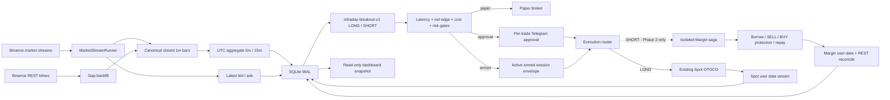
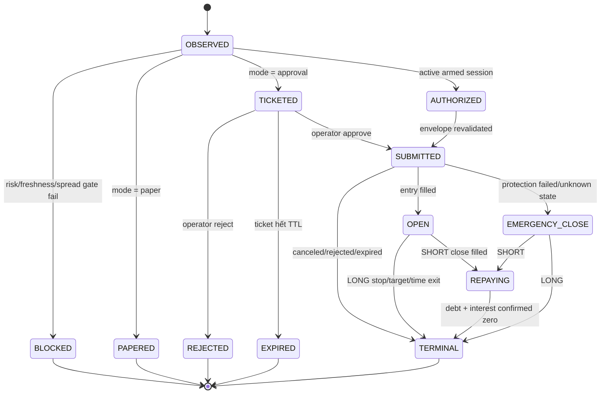

# Short-term Intraday Breakout & Isolated Margin — Kế hoạch triển khai theo giai đoạn

> **Trạng thái:** Proposed — chưa triển khai.
> **Phạm vi V1:** intraday breakout với `15m` xác định regime, `5m` tạo signal và `1m` phục vụ execution; giữ lệnh tối đa 90 phút. V1 research/paper cả LONG và SHORT nhưng chỉ cho phép LONG Spot đi qua rollout live. SHORT Binance Isolated Margin là Phase 2, chỉ bắt đầu sau khi LONG Spot execution stack và economics đã qua gate.
> **Phạm vi Phase 2:** SHORT Binance Isolated Margin, effective leverage tối đa 2x như hard ceiling chứ không phải mục tiêu sizing; Mainnet chỉ chạy canary sau read-only probe và operator chủ động bật permission.
> **Nguyên tắc:** mọi task phải kết thúc bằng test liên quan xanh; không bật Mainnet nếu chưa hoàn thành các cổng rollout ở cuối tài liệu.

## 1. Mục tiêu

Bổ sung một luồng đầu tư ngắn hạn bên cạnh luồng nghiên cứu trung hạn hiện có, với các đặc điểm:

- nhận nến `1m` Binance realtime, tổng hợp deterministic thành `5m/15m` và nhận quote đủ mới cho execution;
- tạo tín hiệu bằng luật deterministic, có thể backtest và tái lập;
- research/paper cả tín hiệu LONG và SHORT nhưng cho phép graduate từng direction độc lập;
- chứng minh economics và LONG Spot execution trước khi xây Margin write path;
- ở Phase 2, quản lý isolated-margin collateral, borrow, interest, repay và margin level;
- giới hạn rủi ro riêng theo lệnh, phiên arm và ngày;
- tái sử dụng ticket/OTOCO cho LONG Spot, bổ sung margin execution saga cho SHORT;
- chạy được ở `paper` mode với LONG/SHORT nhưng không gửi order;
- không phụ thuộc Gemini/OpenAI để phát hiện entry;
- lưu đủ dữ liệu để giải thích vì sao có hoặc không có tín hiệu.

V1 là short-term intraday, không phải high-frequency trading: signal chỉ được tạo khi nến `5m` đóng; nến `1m` chỉ dùng để dựng bar, kiểm tra giá execution và mô phỏng intrabar fill. Không đặt mục tiêu sub-second, market making hoặc microsecond latency. Automatic execution chỉ được phép trong một phiên `armed` ngắn, có hard risk envelope và kill switch; ở V1 armed chỉ cho LONG Spot, SHORT luôn paper cho tới khi Phase 2 qua gate riêng.

## 2. Vì sao repo hiện tại chưa phù hợp

Luồng hiện tại được thiết kế cho trung hạn:

- `EvidenceBuilder` dùng nến `4h` và `1d`, chưa có nến `1m`, market event loop hoặc latency guard;
- full analysis chạy theo lịch `00:15 UTC`, health chạy mỗi 15 phút;
- committee gọi nhiều lượt LLM và hai vòng tranh luận, không phù hợp chạy sau mỗi nến;
- SQLite chưa lưu bar, signal, armed session, margin liability hoặc realized PnL intraday;
- execution đang là Spot long-only và không có borrow/repay/liquidation state;
- trạng thái order chủ yếu được reconcile, chưa nhận `executionReport` realtime.

Các thành phần có thể tái sử dụng:

- `Settings`, symbol allowlist và environment separation;
- `Store` dùng SQLite WAL;
- `SymbolRules`, Decimal sizing và Binance filter validation;
- `TradeTicket`, approval, Telegram ingress và confirmation code;
- OTOCO entry `LIMIT FOK` cùng stop/target bảo vệ cho LONG Spot;
- scheduled health, artifacts và audit log hiện có.

Các phần bắt buộc phải xây mới cho V1:

- canonical `1m` bar store và deterministic `5m/15m` aggregation;
- dynamic cost model dùng actual commission, spread và slippage stress;
- backtester/paper broker dùng cùng strategy function với production và mô phỏng LONG/SHORT liability local;
- automatic-session authorization có TTL và hard limits;

Các phần chỉ xây ở Phase 2 sau Gate E:

- `binance-sdk-margin-trading` adapter;
- isolated-margin account/liability snapshots;
- SHORT execution saga: entry SELL, protection BUY, close và repay;

Paper broker là bắt buộc ngay từ V1 vì Spot Testnet không hỗ trợ Margin `/sapi/*`; Phase 2 chỉ thay paper adapter bằng official Margin adapter sau khi qua gate.

## 3. Product decisions

### 3.1 Phạm vi V1

- Intraday V1 chỉ bật mặc định cho `BTCUSDT`, `ETHUSDT`; BNB/SOL giữ ở luồng trung hạn cho tới khi spread, borrowability và backtest đạt gate tương tự.
- V1 live chỉ LONG Spot. SHORT dùng dữ liệu thị trường thật nhưng paper execution; Phase 2 mới route SHORT sang Binance Isolated Margin. Không dùng Cross Margin để tránh lan rủi ro giữa symbol.
- Leverage hiệu dụng tối đa 2x là hard ceiling; position size luôn xuất phát từ risk budget và stop-after-cost, không xuất phát từ leverage.
- Chỉ một strategy structure: `intraday-breakout-v1`; LONG và SHORT dùng rule đối xứng nhưng metrics, enablement và rollout gates tách riêng.
- Nhịp quyết định chính: khi nến `5m` đóng; `15m` xác định regime; `1m` làm canonical source và execution layer.
- Giá bid/ask và depth snapshot tại signal dùng kiểm tra spread, estimated slippage và xây giá entry; không duy trì raw depth vô hạn.
- Paper mode dùng Mainnet public market data để mô phỏng giá thực tế nhưng không cần private API key và tuyệt đối không gọi write endpoint.
- Chạy historical research rồi realtime paper trước; LONG kiểm thử Spot Testnet và Mainnet approval canary trước khi armed. SHORT margin chỉ được Mainnet canary sau khi LONG armed canary pass.
- Automatic submit chỉ tồn tại trong một armed session tối đa 60 phút, được operator xác nhận trước và có notional/loss/trade-count cap.
- Ở Phase 2, isolated margin account phải được tạo và nạp collateral thủ công. Hệ thống không tự chuyển tiền từ Spot sang Margin.
- Mỗi symbol chỉ có tối đa một intraday position; không scale-in hoặc hedge cùng symbol.
- Không gọi LLM trong fast path.

Giới hạn môi trường: tài liệu chính thức của Binance Spot Testnet ghi rõ chỉ `/api/*` được hỗ trợ và `/sapi/*` không được hỗ trợ. Vì Margin Trading dùng API riêng, unit/contract tests và paper broker là bắt buộc trước read-only Mainnet probe và canary thật. Không gọi một môi trường giả là “margin testnet” nếu Binance không cung cấp contract đó.

### 3.2 Ngoài phạm vi V1

- Sub-second/HFT, colocated execution và market making.
- Cross Margin, Portfolio Margin, Futures và Options.
- Leverage trên 2x.
- Arbitrage, market making và order-book prediction.
- Machine learning model, reinforcement learning hoặc vector database.
- Lưu raw trade/depth tick không giới hạn.
- Trailing stop, partial take-profit và scale-in nhiều tầng.
- Mainnet daemon tự giao dịch 24/7 không có armed-session TTL.

SHORT trong V1 chỉ là paper position có collateral/liability ledger local để research economics. Ở Phase 2, SHORT live luôn là isolated-margin short có borrow asset, liability và repay được audit. Không mô phỏng SHORT live bằng số âm trong Spot account và không mở Futures như một shortcut.

### 3.3 Security constraints

- Dùng API key riêng cho Margin, bật IP allowlist và tắt withdrawal.
- Chỉ bật Margin Trade permission sau Gate F; không dùng key của runner trung hạn nếu có thể tách key.
- Margin secrets chỉ nằm trong environment/secret manager, không nằm trong YAML, SQLite, artifact, Telegram hoặc dashboard.
- Raw signed request, signature, API key và provider payload nhạy cảm không được log.
- `intraday-arm` chỉ chạy local CLI với live confirmation code; Telegram chỉ được disarm khẩn cấp trong V1.
- Runner startup luôn disarmed, kể cả database còn row cũ ở trạng thái `ARMED`.

## 4. Kiến trúc đề xuất



Luồng market stream và luồng daily analysis chạy độc lập. Lỗi Gemini không được làm dừng market stream; lỗi stream không được làm hỏng daily analysis.

## 5. Chế độ vận hành

`intraday.mode` có bốn giá trị:

| Mode | Lưu bar/quote | Tạo signal | Tạo ticket | Gửi order |
|---|---:|---:|---:|---:|
| `disabled` | Không | Không | Không | Không |
| `paper` | Có | Có | Paper ticket | Chỉ mô phỏng |
| `approval` | Có | Có | Có | V1 chỉ LONG Spot sau approval từng lệnh |
| `armed` | Có | Có | Có | V1 chỉ LONG Spot; Phase 2 mới cho SHORT trong active envelope |

`armed` không phải một config bật vĩnh viễn. Config chỉ cho phép capability; để thực sự gửi tự động phải có một row `armed_sessions` chưa hết hạn, đúng environment/account/symbol, còn đủ loss/notional/trade budget và có operator proof. Restart không tự arm lại.

State machine của một signal:



## 6. Strategy specification: `intraday-breakout-v1`

### 6.1 Dữ liệu đầu vào và time alignment

`1m` là canonical bar. `5m` và `15m` được aggregate từ đúng năm/mười lăm nến `1m` theo boundary UTC; historical, paper và production dùng cùng hàm aggregation. Không trộn native `5m/15m` stream với derived bars trong signal path.

Mỗi symbol cần tối thiểu:

- 900 nến `1m` đã đóng để tạo ít nhất 60 nến `15m` và đủ EMA warm-up;
- 60 nến `15m` đã đóng cho regime;
- 40 nến `5m` đã đóng cho ATR/breakout/relative volume;
- bid/ask mới không quá 2 giây;
- commission snapshot của account/symbol mới không quá 1 giờ và được refresh trước mỗi armed session;
- depth snapshot mới không quá 2 giây tại preflight nếu signal dự kiến gửi real order;
- account snapshot mới không quá 5 giây trước khi gửi order;
- với SHORT Phase 2: isolated account, liability, interest rate, max borrowable, liquidation threshold và margin level mới không quá 5 giây;
- Binance symbol rules mới hoặc đã cache trong ngày.

Không dùng nến đang chạy để tạo tín hiệu. Replayed bar chỉ phục vụ recovery/research, không tạo live ticket.

### 6.2 Indicator và cost model tối thiểu

Tự tính bằng Python/`Decimal`, không thêm TA library:

- `EMA20` và `EMA50` trên close `15m`;
- `ATR14` trên nến `5m`;
- highest high và lowest low của 20 nến `5m` trước signal bar;
- relative volume = volume signal bar `5m` / trung bình volume 20 nến `5m` trước;
- spread bps = `(ask - bid) / mid * 10_000`;
- estimated slippage từ depth snapshot cho đúng intended notional;
- actual maker/taker commission từ account khi có private read permission; research fallback dùng explicit conservative fee profile.

Không thêm RSI, MACD, Bollinger Bands hoặc order-book imbalance trong V1. Depth chỉ dùng estimate executable cost cho intended size, không tạo directional signal.

Chuẩn hóa `S`, `T`, `C` về fraction of entry hoặc bps trước khi tính. Đặt `C` là estimated round-trip cost:

```text
C = entry fee + exit fee
  + spread
  + entry slippage + exit slippage
  + borrow interest nếu SHORT
  + adverse-selection buffer
```

Stop distance `S`, target distance `T` và net reward/risk được tính:

```text
net_win  = T - C
net_loss = S + C
net_reward_risk = net_win / net_loss
```

Để net reward/risk tối thiểu `1.5`, target phải thỏa:

```text
T >= 1.5 * S + 2.5 * C
```

Không dùng gross `T/S=1.5` làm gate vì chi phí sẽ khiến net reward/risk thấp hơn 1.5.

### 6.3 Điều kiện tạo LONG candidate

Tất cả điều kiện phải đúng:

1. Nến `5m` vừa đóng, chưa từng xử lý và runner hoàn tất aggregate trong tối đa 5 giây sau close.
2. `EMA20(15m) > EMA50(15m)`.
3. Close `15m` gần nhất lớn hơn `EMA20(15m)`.
4. Close signal bar `5m` lớn hơn highest high của 20 nến `5m` trước đó.
5. Relative volume tối thiểu `1.5`.
6. Quote/cost inputs đủ mới và estimated round-trip cost không vượt `25%` stop distance.
7. Giá execution dự kiến không cao hơn signal close quá `0.15 * ATR14(5m)`; vượt ngưỡng thì block `PRICE_EXTENDED` thay vì chase.
8. Net reward/risk sau fee/spread/slippage/rounding tối thiểu `1.5`.
9. Không có position/pending entry cùng symbol.
10. Tất cả session, account và global risk gates đều pass.

### 6.4 Điều kiện tạo SHORT candidate

Điều kiện price signal đối xứng với LONG, nhưng enablement tách riêng:

1. `EMA20(15m) < EMA50(15m)` và close `15m` dưới `EMA20(15m)`.
2. Close signal bar `5m` thấp hơn lowest low của 20 nến `5m` trước.
3. Relative volume, quote freshness, price-extension, cost-to-stop và net reward/risk gates pass.
4. Trong V1, candidate chỉ được route sang paper broker; `approval/armed` phải block `SHORT_NOT_LIVE_ENABLED`.
5. Ở Phase 2, symbol có margin permission và isolated margin được enabled.
6. Base asset đang borrowable; max borrowable đủ cho quantity sau rounding.
7. Projected liability và projected margin buffer pass hard limits của pair hiện tại.
8. Không có debt cũ, open margin order hoặc position chưa reconcile cùng symbol.
9. Armed session cho phép `SHORT` đúng symbol và Phase 2 rollout gate đã pass.

SHORT Phase 2 bị block nếu không lấy được interest/max-borrow/liquidation-threshold/margin-level chính xác; không fallback sang dữ liệu cache quá hạn.

Các hằng số strategy được giữ trong code và gắn với version `intraday-breakout-v1`. LONG/SHORT giữ cùng structure để tránh parameter mining nhưng mỗi direction có metrics và feature flag riêng; không đưa threshold vào YAML nếu chưa có backtest/version mới.

### 6.5 Entry, stop, target và execution policy

V1 dùng đúng một execution policy để backtest không trộn maker/taker assumptions:

- entry là aggressive marketable `LIMIT FOK` với worst-price cap; no-fill thì bỏ signal, không chase/requote;
- LONG entry tối đa ask cộng `3 bps`, làm tròn lên theo `tick_size`;
- SHORT Phase 2 entry tối thiểu bid trừ `3 bps`, làm tròn xuống theo `tick_size`;
- cost profile mặc định giả định taker ở entry và protective/time exit; maker fill không được dùng để làm đẹp backtest;
- `S = 1.0 * ATR14(5m)`; không tự nới stop chỉ để bù chi phí;
- `T = 1.5 * S + 2.5 * C` trước rounding;
- LONG: stop dưới entry, target trên entry; SHORT: stop trên entry, target dưới entry;
- mọi giá được round theo hướng bảo thủ và `tick_size`, sau đó tính lại net reward/risk;
- armed signal/order deadline: 30 giây sau `5m` bar close; approval ticket có thể tồn tại tối đa 60 giây nhưng phải re-read quote/depth và pass lại price-extension/cost gates tại lúc approve;
- max hold: 90 phút kể từ khi entry fill;
- quá max hold phải auto-exit trong `armed`; `paper/approval` mô phỏng hoặc cảnh báo theo mode.

Nếu `C > 0.25*S`, target không hợp lý so với volatility, price đã extended, hoặc net reward/risk sau rounding thấp hơn `1.5`, signal bị `BLOCKED`. Strategy không được tăng `S` để làm cost ratio trông đẹp hơn.

Post-only/pullback-maker là strategy/execution policy khác và chỉ được xem xét sau V1; không fallback từ aggressive policy sang maker trong cùng signal.

### 6.6 Idempotency

Signal ID là SHA-256 rút gọn của:

```text
environment | account_type | strategy_version | symbol | direction | interval | bar_open_time
```

Database có unique constraint tương ứng. Restart hoặc nhận lặp WebSocket event không được tạo ticket thứ hai.

## 7. Quản trị rủi ro intraday và margin

Thông số khởi đầu dùng cho paper và Mainnet canary; không phải khuyến nghị đầu tư:

```yaml
intraday:
  mode: disabled
  market_data_environment: mainnet
  intraday_symbols: [BTCUSDT, ETHUSDT]
  allow_isolated_margin: false
  allow_armed_execution: false
  risk_per_trade: "0.0005"
  max_trade_notional_pct: "0.02"
  max_gross: "0.10"
  max_short_gross: "0.05"
  max_effective_leverage: "2"
  min_projected_margin_buffer: "1.50"
  halt_margin_buffer: "1.25"
  max_open_positions: 1
  max_trades_per_day: 6
  max_daily_loss: "0.0025"
  cooldown_after_losses: 3
  cooldown_minutes: 60
  max_hold_minutes: 90
  armed_session_minutes: 60
  mainnet_long_canary_usdt: "25"
  mainnet_short_canary_usdt: "10"
```

Ý nghĩa:

- `risk_per_trade=0.0005`: thua tối đa dự kiến 0.05% NAV trước gap/slippage bất thường;
- `max_daily_loss=0.0025`: ngừng entry mới khi net realized PnL ngày <= -0.25% opening NAV, tương đương tối đa năm full-risk losses theo budget khởi đầu;
- một position tại một thời điểm trong MVP;
- trade notional tối đa 2% NAV; V1 LONG Mainnet canary hard cap 25 USDT, Phase 2 SHORT hard cap 10 USDT;
- debt không được vượt collateral value, kể cả khi Binance cho borrow nhiều hơn;
- không hard-code một margin level tuyệt đối cho mọi pair: `margin_buffer = projected_margin_level / current_liquidation_threshold`; entry cần buffer >=1.50 và live buffer <1.25 thì disarm/emergency-exit;
- sau ba lệnh thua liên tiếp: paper cooldown 60 phút; approval/armed disarm hết phiên và cần operator arm lại;
- quá sáu entry đã fill trong ngày thì không tạo entry mới;
- mọi loss/fee/borrow interest đều tính vào daily PnL.

Position sizing luôn dùng loss sau chi phí, không dùng leverage làm đầu vào:

```text
risk_budget_usdt = opening_nav_usdt * risk_per_trade
quantity_by_risk = risk_budget_usdt / (entry_price * (S + C))
final_quantity = min(quantity_by_risk, notional_cap / entry_price)
```

Sau đó mới round theo `step_size` và revalidate actual notional, expected loss, Binance filters và canary cap. Nếu rounded quantity dưới minimum notional thì block, không tự tăng risk/notional để ép lệnh hợp lệ.

### 7.1 Armed-session envelope

Một armed session bắt buộc có:

- operator, channel và confirmation proof;
- environment=`mainnet`, allowed symbols và allowed directions;
- `starts_at`, `expires_at` tối đa 60 phút;
- max entries, max cumulative notional và max session loss bằng số tuyệt đối USDT;
- trạng thái `ARMED`, `DISARMED`, `EXPIRED` hoặc `HALTED`;
- không được tự gia hạn hoặc khôi phục sau process restart.

Trước mỗi order, execution re-read row trong SQLite transaction và revalidate toàn bộ envelope. Telegram `/disarm-intraday` hoặc local halt file phải block entry mới ngay cả khi signal đã tạo.

### 7.2 Thứ tự risk gates

Kiểm tra theo thứ tự rẻ và an toàn nhất:

1. kill switch/mode/environment/armed-session gate;
2. market data latency và duplicate signal;
3. daily/session halt, cooldown và max trades;
4. pending order, existing position và unknown execution state;
5. spread, estimated depth slippage, cost-to-stop, price-extension, net reward/risk và strategy conditions;
6. current account/portfolio freshness;
7. với SHORT: isolated enabled, borrowable, max borrow, interest và liability freshness;
8. Phase 2 projected margin buffer, leverage, trade/short/gross limits;
9. global risk limits hiện có;
10. Binance quantity/notional/price/order filters;
11. canary hard cap và Mainnet graduation.

Gate fail phải lưu `blocked_reason` dạng enum ổn định, không chỉ ghi log text.

### 7.3 Kill switch và emergency behavior

Không thêm remote **arm** từ dashboard trong V1. Cho phép Telegram disarm khẩn cấp và dùng file flag local làm hard stop:

```text
data/INTRADAY_HALT
```

Nếu file tồn tại, runner vẫn thu thập market data và quản lý/đóng position đang mở nhưng không tạo entry mới. `desk intraday-status` phải hiển thị trạng thái halt. File không được tự xóa khi restart.

Emergency conditions gồm Phase 2 margin buffer thấp, protection placement fail, liability không xác định, user-stream/reconcile disagreement hoặc session loss cap breached. Hành vi là disarm, cancel entry chưa fill, đóng exposure theo saga đã test và repay; không chỉ dừng process để mặc position trần.

## 8. LLM/Gemini trong luồng ngắn hạn

Gemini không tạo trigger, direction, entry, stop, leverage hoặc quantity trong V1.

Sau khi MVP ổn định có thể thêm một context job riêng:

- chạy tối đa mỗi 4 giờ, không chạy mỗi nến/phút;
- dùng dữ liệu đã tổng hợp, không gửi raw bars;
- chỉ trả `risk_on`, `neutral`, `risk_off` cùng lý do;
- context lỗi/rate-limit thì signal engine tiếp tục chạy deterministic;
- context chỉ có quyền giảm rủi ro hoặc veto entry, không được tăng size;
- cache kết quả theo symbol/cutoff để không gọi lặp.

Context job này thuộc backlog sau V1/Phase 2 và không phải điều kiện hoàn thành hệ thống giao dịch.

## 9. Data model

V1 nâng `schema_meta.version` từ 2 lên 3 bằng migration idempotent trong `Store.__init__` và chỉ thêm intraday bars/quotes/signals/sessions/armed sessions/paper positions. Phase 2 nâng từ 3 lên 4 khi thêm Margin snapshots/sagas; không bắt V1 carry schema write-path chưa dùng.

### 9.1 `intraday_bars`

```sql
CREATE TABLE intraday_bars (
  symbol TEXT NOT NULL,
  interval TEXT NOT NULL,
  open_time TEXT NOT NULL,
  close_time TEXT NOT NULL,
  open TEXT NOT NULL,
  high TEXT NOT NULL,
  low TEXT NOT NULL,
  close TEXT NOT NULL,
  volume TEXT NOT NULL,
  source TEXT NOT NULL,
  received_at TEXT NOT NULL,
  PRIMARY KEY(symbol, interval, open_time)
);
CREATE INDEX intraday_bars_latest
ON intraday_bars(symbol, interval, close_time DESC);
```

Chỉ nhận interval `1m`, `5m`, `15m`; `1m` có `source=BINANCE`, `5m/15m` có `source=DERIVED_UTC`. Giá trị tiền lưu bằng decimal string. Derived bar được rebuild deterministically từ canonical `1m`, không được silently thay bằng native stream bar.

### 9.2 `intraday_quotes`

```sql
CREATE TABLE intraday_quotes (
  symbol TEXT PRIMARY KEY,
  bid TEXT NOT NULL,
  ask TEXT NOT NULL,
  event_time TEXT NOT NULL,
  received_at TEXT NOT NULL
);
```

Mỗi symbol chỉ giữ quote mới nhất; không tạo bảng raw quote history.

### 9.3 `intraday_signals`

```sql
CREATE TABLE intraday_signals (
  id TEXT PRIMARY KEY,
  environment TEXT NOT NULL,
  strategy_version TEXT NOT NULL,
  symbol TEXT NOT NULL,
  account_type TEXT NOT NULL,
  direction TEXT NOT NULL,
  interval TEXT NOT NULL,
  bar_open_time TEXT NOT NULL,
  observed_at TEXT NOT NULL,
  state TEXT NOT NULL,
  entry TEXT,
  stop TEXT,
  target TEXT,
  estimated_round_trip_cost TEXT,
  net_reward_risk TEXT,
  score TEXT,
  reason TEXT NOT NULL,
  ticket_id TEXT,
  payload TEXT NOT NULL,
  UNIQUE(environment, account_type, strategy_version, symbol, direction, interval, bar_open_time)
);
CREATE INDEX intraday_signals_recent
ON intraday_signals(observed_at DESC);
```

`payload` chỉ chứa indicator inputs, fee profile ID, spread/depth-slippage estimate, risk snapshot và version; không chứa credentials hoặc raw provider response.

### 9.4 `intraday_sessions`

```sql
CREATE TABLE intraday_sessions (
  environment TEXT NOT NULL,
  trading_date TEXT NOT NULL,
  opening_nav_usdt TEXT NOT NULL,
  realized_pnl_usdt TEXT NOT NULL,
  filled_entries INTEGER NOT NULL,
  consecutive_losses INTEGER NOT NULL,
  cooldown_until TEXT,
  halted_reason TEXT,
  updated_at TEXT NOT NULL,
  PRIMARY KEY(environment, trading_date)
);
```

Ngày giao dịch dùng UTC. Session update phải nằm trong transaction cùng event terminal để tránh tăng counter hai lần.

### 9.5 `armed_sessions`

```sql
CREATE TABLE armed_sessions (
  id TEXT PRIMARY KEY,
  environment TEXT NOT NULL,
  state TEXT NOT NULL,
  actor TEXT NOT NULL,
  channel TEXT NOT NULL,
  allowed_symbols TEXT NOT NULL,
  allowed_directions TEXT NOT NULL,
  max_entries INTEGER NOT NULL,
  max_notional_usdt TEXT NOT NULL,
  max_loss_usdt TEXT NOT NULL,
  used_entries INTEGER NOT NULL,
  used_notional_usdt TEXT NOT NULL,
  realized_pnl_usdt TEXT NOT NULL,
  starts_at TEXT NOT NULL,
  expires_at TEXT NOT NULL,
  disarmed_at TEXT,
  reason TEXT
);
```

Chỉ một armed session được active. Không lưu confirmation code/proof raw; chỉ lưu actor/channel/audit outcome.

### 9.6 `paper_positions` — V1/schema v3

```sql
CREATE TABLE paper_positions (
  id TEXT PRIMARY KEY,
  signal_id TEXT NOT NULL UNIQUE,
  symbol TEXT NOT NULL,
  direction TEXT NOT NULL,
  state TEXT NOT NULL,
  quantity TEXT NOT NULL,
  entry TEXT NOT NULL,
  stop TEXT NOT NULL,
  target TEXT NOT NULL,
  collateral_usdt TEXT NOT NULL,
  borrowed_base TEXT NOT NULL,
  interest_base TEXT NOT NULL,
  realized_pnl_usdt TEXT,
  opened_at TEXT NOT NULL,
  max_hold_at TEXT NOT NULL,
  updated_at TEXT NOT NULL,
  payload TEXT NOT NULL
);
```

Paper SHORT có liability ledger thật trong database nhưng tuyệt đối không map row này thành Binance order/debt. Terminal paper position phải có simulated exposure/liability bằng 0 và event accounting idempotent.

### 9.7 `margin_account_snapshots` — Phase 2/schema v4

```sql
CREATE TABLE margin_account_snapshots (
  id INTEGER PRIMARY KEY,
  environment TEXT NOT NULL,
  symbol TEXT NOT NULL,
  as_of TEXT NOT NULL,
  net_asset_usdt TEXT NOT NULL,
  collateral_usdt TEXT NOT NULL,
  borrowed_base TEXT NOT NULL,
  interest_base TEXT NOT NULL,
  margin_level TEXT NOT NULL,
  max_borrowable_base TEXT NOT NULL,
  payload TEXT NOT NULL
);
CREATE INDEX margin_account_snapshots_latest
ON margin_account_snapshots(environment, symbol, as_of DESC);
```

Chỉ lưu ở startup/health và trước/sau execution; không poll rồi lưu mỗi giây.

### 9.8 `margin_trade_sagas` — Phase 2/schema v4

SHORT không thể reconstruct an toàn chỉ từ Spot ticket. Cần một ledger explicit:

```sql
CREATE TABLE margin_trade_sagas (
  id TEXT PRIMARY KEY,
  signal_id TEXT NOT NULL UNIQUE,
  ticket_id TEXT NOT NULL UNIQUE,
  armed_session_id TEXT,
  environment TEXT NOT NULL,
  symbol TEXT NOT NULL,
  state TEXT NOT NULL,
  requested_quantity TEXT NOT NULL,
  borrowed_quantity TEXT NOT NULL,
  sold_quantity TEXT NOT NULL,
  repaid_quantity TEXT NOT NULL,
  entry_order_id TEXT,
  protection_order_list_id TEXT,
  exit_order_id TEXT,
  liability_base TEXT NOT NULL,
  interest_base TEXT NOT NULL,
  max_hold_at TEXT NOT NULL,
  updated_at TEXT NOT NULL,
  payload TEXT NOT NULL
);
```

State transition và event insert phải nằm cùng transaction. Saga terminal chỉ khi exposure bằng 0, open margin orders bằng 0 và liability+interest được xác nhận bằng 0 hoặc dưới Binance dust threshold đã ghi nhận.

## 10. Market stream và recovery

V1 sử dụng `binance-sdk-spot` đã cài cho public market streams và Spot account/commission reads. Chỉ ở Phase 2 mới thêm đúng một dependency `binance-sdk-margin-trading` cho signed Margin REST/user-data operations; không thêm dependency Margin trước khi Gate E pass và không dùng thư viện Binance không chính thức.

### 10.1 Subscription

Mỗi symbol subscribe:

- `<symbol>@kline_1m`;
- `<symbol>@bookTicker`.

Không subscribe native `5m/15m`, depth hoặc aggTrade trong V1. Khi có real-order candidate, preflight gọi một bounded REST depth snapshot cho đúng intended notional; response được tóm tắt vào signal/cost payload, không lưu raw book vô hạn. Paper realtime có thể thực hiện cùng read-only snapshot để đo model error.

### 10.2 Event handling

- Validate symbol thuộc allowlist.
- Reject giá/volume âm hoặc OHLC không hợp lệ.
- Upsert quote mới nhất.
- Chỉ upsert `1m` kline khi Binance đánh dấu candle closed.
- Sau khi commit `1m`, aggregate/rebuild affected UTC `5m/15m` bars trong cùng deterministic path.
- Chỉ evaluate khi một derived `5m` bar vừa đóng và transaction aggregate đã commit.
- Callback không gọi LLM, Telegram hoặc REST trực tiếp; orchestration xử lý sau commit.

### 10.3 Bootstrap và gap backfill

Research backfill chạy riêng trước Gate A:

1. tải mặc định 730 ngày `1m` cho BTCUSDT/ETHUSDT bằng Binance public-data archives, REST chỉ lấp gap;
2. checksum/upsert canonical bars rồi rebuild toàn bộ `5m/15m` theo UTC;
3. xuất coverage/gap report theo symbol và tháng;
4. không bắt live runner tải lại toàn bộ research history ở startup.

Trước khi live runner mở stream:

1. đảm bảo ít nhất 7 ngày canonical `1m` gần nhất; REST/public archive chỉ lấp phần thiếu;
2. upsert theo primary key và rebuild affected derived bars;
3. tìm gap trong warm-up window;
4. fail closed nếu chưa đủ 900 nến `1m` liên tục hoặc derived bars không khớp boundary;
5. sau đó mới đánh dấu runner `ready`.

Sau reconnect:

1. lấy close time cuối trong database;
2. REST backfill từ bar kế tiếp đến bar đóng gần nhất;
3. journal các nến `1m` bị thiếu theo thứ tự thời gian và rebuild `5m/15m` liên quan;
4. mở lại stream;
5. không tạo real ticket cho replay; derived signal bar quá 10 phút tuổi chỉ journal là `STALE_REPLAY`.

### 10.4 Connection lifecycle

- reconnect với exponential backoff 1, 2, 4, 8, tối đa 30 giây;
- chủ động rotate connection trước giới hạn 24 giờ;
- heartbeat ghi `last_event_at`, `last_closed_bar_at`, `reconnect_count`;
- sau 10 giây không có quote event: trạng thái `STALE`, disarm và block entry;
- aggregate/signal lag trên 5 giây tại `5m` close: signal chỉ paper/journal, không gửi real order;
- shutdown bằng SIGTERM phải close stream và SQLite sạch.

## 11. Execution và order updates

### 11.1 Execution router và ticket

LONG Spot tiếp tục dùng `TradeTicket`/OTOCO hiện có. V1 không tạo real SHORT ticket. Ở Phase 2, SHORT tạo ticket `side=SELL`, `intent=OPEN_SHORT`, `account_type=ISOLATED_MARGIN`; không ép SHORT qua `ResearchDecision(action="REDUCE")` vì đó là bán tài sản Spot đang sở hữu.

Thêm `build_intraday_ticket()` và execution router tối thiểu theo `account_type/direction`. Không thay hành vi của ticket trung hạn cũ.

`risk_snapshot` bổ sung:

```json
{
  "source": "intraday",
  "strategy_version": "intraday-breakout-v1",
  "account_type": "isolated_margin",
  "direction": "SHORT",
  "armed_session_id": "...",
  "signal_id": "...",
  "signal_bar_open_time": "...",
  "regime_bar_open_time": "...",
  "atr14_5m": "...",
  "spread_bps": "...",
  "estimated_slippage_bps": "...",
  "round_trip_cost_bps": "...",
  "net_reward_risk": "1.5",
  "max_hold_at": "..."
}
```

Approval, actor allowlist, confirmation code, hard Mainnet cap và idempotent client order ID giữ nguyên. Armed execution dùng session authorization riêng, không tạo approval giả mang tên operator.

### 11.2 SHORT isolated-margin saga — Phase 2 only

Happy path:

1. Re-read armed session và risk gates trong transaction.
2. Query isolated account, open orders, current liability, interest rate và max borrowable.
3. Borrow đúng base quantity đã size; ghi transaction ID trước bước tiếp theo.
4. Submit entry `SELL LIMIT FOK` với client ID deterministic.
5. Nếu entry không fill: repay toàn bộ borrowed amount + accrued interest và terminal `NO_FILL`.
6. Nếu partial/unknown: query order; repay phần chưa bán, chỉ bảo vệ sold quantity.
7. Ngay khi sold quantity được xác nhận, đặt Margin OCO BUY: take-profit dưới entry và stop trên entry.
8. Nếu protection fail: emergency BUY để đóng sold quantity, sau đó repay; không retry mù.
9. Khi OCO hoặc max-hold exit fill: cancel sibling/open orders, query actual fills, repay debt + interest.
10. Chỉ terminal khi account query xác nhận không còn exposure/order/liability ngoài dust được chấp nhận.

Task 0 phải xác nhận chính xác SDK methods, `isIsolated` và `sideEffectType` ở version được pin. Nếu dùng `AUTO_BORROW_REPAY`/`AUTO_REPAY`, saga vẫn phải lưu actual borrow/repay transaction và reconcile debt; không xem một order response là bằng chứng debt đã về 0.

### 11.3 LONG Spot flow

LONG dùng OTOCO hiện có nhưng thay đổi cho intraday:

- không chờ approval từng lệnh khi armed session hợp lệ;
- armed order deadline 30 giây tính từ `5m` bar close;
- approval submit chỉ hợp lệ trong 60 giây và phải revalidate current quote, depth-cost, price extension, account và risk budget;
- nếu OTOCO protection không được xác nhận, emergency close;
- max-hold worker mặc định 90 phút, tự cancel protection, confirm cancel rồi exit;
- mọi hành vi mới phải giữ nguyên flow trung hạn có approval.

### 11.4 User data streams và reconciliation

V1 bổ sung Spot authenticated user data stream; Phase 2 bổ sung Margin stream:

- Spot `executionReport/listStatus` cập nhật LONG chain;
- Phase 2: Margin user data events cập nhật isolated order/account state theo contract chính thức;
- duplicate event được loại theo order ID + execution type + event time;
- event stream chỉ cập nhật state; không tự gửi order mới;
- Spot reconciliation hiện có vẫn là source of truth cho LONG;
- Phase 2: Margin REST account/order/borrow-repay history là source of truth cho SHORT sau reconnect hoặc parse error.

### 11.5 Max-hold exit

Trong `paper`, mô phỏng time exit. Trong `approval`, gửi cảnh báo và tạo EXIT action. Trong `armed`, max-hold exit là bắt buộc tự động vì một intraday position không được phụ thuộc operator online.

Thứ tự: `reconcile -> cancel protection -> confirm cancel -> submit opposite-side FOK/marketable limit -> reconcile fill -> repay nếu SHORT`. Nếu không xác định được trạng thái, disarm và alert; không submit lệnh ngược chiều lần hai.

## 12. Telegram và dashboard

### 12.1 Telegram signal message

Gửi trước lệnh ở `approval`; gửi thông báo ngay sau submit ở `armed`:

```text
🟢 BTCUSDT · INTRADAY LONG · SPOT
Giá hiện tại: 63,950 USDT
Entry: 63,968 · Stop: 63,620 · Target: 64,615
Net Risk/Reward: 1.50 · Round-trip cost: 9.2 bps
Regime 15m: EMA20 > EMA50
Breakout 5m: 20-bar high · Relative volume: 1.82x
Spread: 2.4 bps · Slippage estimate: 1.8 bps
Rủi ro dự kiến: 0.05% NAV · Max hold: 90 phút
Armed session: a1b2… · Còn 23 phút · 2/5 entries

Approve <ticket> <code> | Reject <ticket>
```

Phase 2 SHORT message bổ sung borrow quantity, interest rate, liability, current/projected margin buffer và repay state; không dùng một `margin level` tuyệt đối không gắn với liquidation threshold của pair.

Không gửi message cho mọi nến không có signal. Blocked signals chỉ lên dashboard/log, trừ `daily_halt`, stream stale hoặc provider outage.

### 12.2 Dashboard V1.1

Mở rộng snapshot read-only hiện có sau khi backend ổn định:

- runner state: ready/stale/reconnecting/halted;
- bid, ask, spread và timestamp;
- canonical `1m`, derived `5m/15m` cuối cùng và stream/aggregate latency;
- latest LONG/SHORT signal, state và reason;
- daily risk budget đã dùng;
- armed-session TTL/budget, filled entries, consecutive losses và cooldown;
- ticket/position stop, target và max hold time;
- account type và direction; Phase 2 bổ sung margin buffer, collateral, liability, interest và repay state;
- kill-switch state.

Không thêm nút BUY/SELL trực tiếp trên dashboard. Arm/disarm và approval tiếp tục qua Telegram/local CLI có confirmation proof.

## 13. CLI đề xuất

Giữ top-level commands để không cần tái cấu trúc Typer:

```bash
desk intraday-backfill --days 730
desk intraday-backtest BTCUSDT --direction both --from 2024-01-01 --to 2026-06-30
desk intraday-run
desk intraday-run --once
desk intraday-status
desk intraday-signals --limit 20
desk intraday-arm --minutes 30 --symbols BTCUSDT --directions LONG --max-entries 2 --max-notional 50 --max-loss 1 --code <code>
desk intraday-disarm
desk margin-doctor --read-only
desk margin-reconcile BTCUSDT
desk margin-emergency-close BTCUSDT --code <code>
```

Behavior:

- `intraday-backfill`: chỉ tải/lưu closed bars, idempotent;
- `intraday-backtest`: không dùng network nếu bars đã đủ;
- `intraday-run`: long-running stream + evaluate + position watchdog;
- `intraday-run --once`: backfill/reconcile/evaluate nhưng không hỗ trợ armed auto mode;
- `intraday-arm`: fail nếu config, Mainnet confirmation, risk budget hoặc clock sync không pass; chỉ yêu cầu margin-doctor khi Phase 2 và allowed direction có `SHORT`;
- `intraday-disarm`: block entry mới nhưng vẫn quản lý position đang mở;
- `margin-doctor --read-only`: không borrow/order/transfer; kiểm tra API permission, isolated account, collateral, borrowability và account state;
- `margin-emergency-close`: yêu cầu live confirmation code và luôn reconcile trước;
- mọi command hỗ trợ global `--json` hiện có.

`--directions SHORT` bị reject trong V1. Sau Gate F, config Phase 2 và margin-doctor chỉ cho phép per-trade SHORT approval canary; chỉ sau Gate G mới cho phép armed SHORT session.

## 14. Backtest và đánh giá

Backtester/paper broker dùng cùng `evaluate_intraday_breakout()` với production, không copy strategy logic.

### 14.1 Mô hình fill

- signal chỉ được tạo sau khi `5m` bar đóng; fill simulation bắt đầu từ `1m` bar kế tiếp, không fill trong signal bar;
- aggressive execution policy dùng mức xấu hơn giữa configured worst-price cap và first eligible `1m` open/high-low path; vượt cap thì `NO_FILL`, không tự giả định chase;
- mặc định tính taker fee ở entry và exit theo explicit fee profile; không trộn maker fill vào cùng report;
- cộng spread, intended-notional slippage, adverse-selection buffer và output riêng từng cost component;
- SHORT tính borrow interest theo thời gian giữ và rate snapshot/configured stress rate;
- nếu một `1m` bar chạm cả stop và target, chọn stop trước để tránh optimistic bias;
- nếu volume bar không đủ fill quantity theo participation cap, reject hoặc partial-fill bảo thủ;
- time exit dùng mức giá bảo thủ từ first eligible `1m` bar tại/sau deadline;
- không dùng data sau timestamp đang đánh giá.

Backtest chạy ít nhất ba cost scenarios độc lập:

1. `base`: actual/current account commission profile + conservative spread/slippage;
2. `stress_2x`: gấp đôi spread/slippage và không giảm fee;
3. `degraded_fill`: thêm adverse-selection, giảm fill ratio và ưu tiên no-fill khi giá vượt cap.

Post-only/pullback-maker nếu được nghiên cứu phải có strategy version/report riêng; không so sánh kết quả bằng cách đổi fill assumption giữa train và out-of-sample.

### 14.2 Output

Mỗi backtest xuất JSON và Markdown:

- sample count;
- signal count, attempted entries, fill ratio và no-fill reasons;
- win rate;
- gross/net expectancy theo R;
- bootstrap confidence interval của net expectancy theo block ngày;
- profit factor;
- max drawdown theo R và USDT;
- average hold time;
- fee/spread/slippage/adverse-selection/borrow-interest total;
- cost-to-stop ratio và net reward/risk distribution;
- LONG và SHORT metrics tách riêng;
- blocked signal counts theo reason;
- kết quả theo symbol và theo tháng.

### 14.3 Research gates trước paper/live execution

- ít nhất 500 historical trades tổng cộng và tối thiểu 200 out-of-sample trades;
- tối thiểu 100 out-of-sample trades cho mỗi direction được đề nghị bật live;
- dữ liệu phủ ít nhất 12 tháng, mục tiêu 24 tháng, và có bull/bear/high-volatility/low-volatility periods;
- split theo thời gian; không random shuffle. Final out-of-sample period bị khóa trước khi xem kết quả;
- không có look-ahead trong test fixtures;
- base out-of-sample net expectancy tối thiểu `0.10R/trade` và profit factor tối thiểu `1.20`;
- block-bootstrap confidence interval, sensitivity report và trade clustering phải được xuất; nếu lower bound âm sâu hoặc kết quả phụ thuộc vài outlier thì không graduate;
- `stress_2x` expectancy vẫn lớn hơn 0 và drawdown không phá risk assumptions;
- không symbol nào chiếm hơn 70% tổng số trade hoặc hơn 70% tổng net profit;
- không direction nào được bật nhờ metrics gộp che lỗ direction đó;
- không một tháng nào tạo hơn 50% tổng lợi nhuận và kết quả không phụ thuộc một tháng duy nhất.

Đây là cổng kỹ thuật để tiếp tục thử nghiệm, không phải cam kết lợi nhuận.

## 15. Implementation plan

### Task 0 — Baseline, environment truth và Spot execution-cost spikes

**Files:** không sửa product code.

- [ ] Ghi `git status --short`; không reset thay đổi của người dùng.
- [ ] Chạy baseline:

```bash
.venv/bin/python -m pytest -q
.venv/bin/ruff check .
.venv/bin/ruff format --check .
```

- [ ] Spike `binance_sdk_spot.websocket_streams` cho kline `1m`, bookTicker, reconnect và close.
- [ ] Spike Spot account commission read và symbol-specific maker/taker rates; xác nhận fee profile có thể snapshot mà không log credentials.
- [ ] Spike bounded REST depth snapshot cho intended notional và ghi contract fixture đã sanitize.
- [ ] Xác nhận Spot Testnet `/sapi/*` không được hỗ trợ; không chạy borrow/order probe vào Testnet.
- [ ] Xác nhận API key Mainnet read-only chưa có Margin Trade permission trong giai đoạn này.
- [ ] Ghi contract fixtures đã sanitize, sau đó xóa spike/temp credentials.

**Done when:** baseline xanh; Spot stream/commission/depth contracts và environment matrix được chứng minh, không suy đoán endpoint hoặc cần Margin write capability.

---

### Task 1 — Config và domain contracts LONG/SHORT

**Files:**

- Modify: `src/crypto_desk/config.py`
- Modify: `src/crypto_desk/domain.py`
- Modify: `config.example.yaml`
- Modify: `tests/test_config.py`
- Create: `tests/test_intraday.py`

- [ ] Thêm `IntradaySettings` đúng mục 7, mặc định `disabled`, margin/armed đều false.
- [ ] Thêm dataclasses `IntradayBar`, `BookQuote`, `EstimatedCosts`, `IntradaySignal`, `IntradaySession`, `ArmedSession`, `PaperPosition`.
- [ ] Thêm literals `Direction=LONG|SHORT`, `AccountType=SPOT|ISOLATED_MARGIN` và `PaperPositionState`; Margin saga states được thêm ở Task 9.
- [ ] Mở rộng ticket cho TTL giây/account type/direction mà vẫn deserialize ticket cũ.
- [ ] Validate canonical/derived interval, OHLC, direction-price relation, estimated costs, UTC timestamp và non-negative paper liability.
- [ ] Reject V1 config `approval/armed` có direction `SHORT`; reject armed nếu environment không Mainnet hoặc canary cap vượt hard code cap.

Run:

```bash
.venv/bin/python -m pytest tests/test_config.py tests/test_intraday.py -q
```

**Done when:** config cũ vẫn load disabled; mọi margin/armed capability là opt-in và fail closed.

---

### Task 2 — SQLite migration, armed sessions và paper-position ledger

**Files:**

- Modify: `src/crypto_desk/store.py`
- Modify: `tests/test_domain_store.py`

- [ ] Viết migration tests từ fresh DB và schema v2 DB.
- [ ] Thêm bảng mục 9.1–9.6, nâng schema từ v2 lên v3; chưa thêm Margin tables.
- [ ] Thêm bar/quote/signal/session repository methods idempotent.
- [ ] Thêm atomic `arm_session`, `consume_arm_budget`, `disarm_session`; chỉ một session active.
- [ ] Thêm compare-and-set paper-position transition; reject transition lùi hoặc terminal->active.
- [ ] Test process restart không tự arm; expired session không consume budget.
- [ ] Test duplicate event/signal/order không tăng PnL, entries hoặc paper liability hai lần.

Run:

```bash
.venv/bin/python -m pytest tests/test_domain_store.py -q
```

**Done when:** DB constraints bảo vệ idempotency và armed/paper state ngay cả khi service code gọi lặp; fresh V1 DB không có Margin write schema.

---

### Task 3 — Pure multi-timeframe intraday strategy

**Files:**

- Create: `src/crypto_desk/intraday.py`
- Modify: `tests/test_intraday.py`

- [ ] Test/implement UTC aggregation, EMA `15m`, ATR/high-low/relative-volume `5m`, spread và cost model bằng Decimal.
- [ ] Implement `evaluate_intraday_breakout()` trả LONG, SHORT hoặc blocked signal.
- [ ] Test công thức `net_reward_risk=(T-C)/(S+C)`, `T>=1.5*S+2.5*C`, cost-to-stop và rounding sau cost.
- [ ] Test từng gate LONG và SHORT, including stale bar/quote/depth, insufficient history, price extension và fee-dominates-edge.
- [ ] Test SHORT stop > entry > target; LONG stop < entry < target sau rounding.
- [ ] Test deterministic signal ID gồm direction/account type.
- [ ] Test dữ liệu tương lai không thay đổi kết quả cutoff cũ.

Interface:

```python
def evaluate_intraday_breakout(
    *,
    symbol: str,
    one_minute: tuple[IntradayBar, ...],
    five_minute: tuple[IntradayBar, ...],
    fifteen_minute: tuple[IntradayBar, ...],
    quote: BookQuote,
    rules: SymbolRules,
    costs: EstimatedCosts,
    cutoff: datetime,
) -> IntradaySignal:
    ...
```

**Done when:** strategy không I/O/time global và cùng code phục vụ backtest, paper, approval, armed.

---

### Task 4 — Canonical 1m market data, aggregation, backfill và runner

**Files:**

- Create: `src/crypto_desk/market_stream.py`
- Modify: `src/crypto_desk/cli.py`
- Create: `tests/test_market_stream.py`
- Modify: `tests/test_service_cli.py`

- [ ] Parse/upsert closed canonical `1m`, aggregate deterministic `5m/15m` theo UTC và upsert latest quote.
- [ ] Implement pagination/public-data archive import, checksum, gap detection và bounded retry.
- [ ] Thêm `desk intraday-backfill` mặc định 730 ngày research history với JSON coverage/gap summary.
- [ ] Chỉ subscribe `kline_1m` và `bookTicker`; evaluate sau khi derived `5m` bar commit.
- [ ] Implement 5-second `5m` aggregate/signal-latency guard, 10-second quote stale guard, reconnect/backfill, 24h rotate và SIGTERM shutdown.
- [ ] Replay chỉ journal; không tạo real order từ historical/reconnected bar.
- [ ] Test malformed/duplicate/out-of-order events, reconnect gap và graceful shutdown.

**Done when:** runner không mất closed bar, không duplicate signal và stale stream luôn block/disarm entry.

---

### Task 5 — Backtester và paper margin broker

**Files:**

- Create: `src/crypto_desk/backtest.py`
- Create: `src/crypto_desk/paper.py`
- Modify: `src/crypto_desk/cli.py`
- Create: `tests/test_backtest.py`
- Create: `tests/test_paper.py`

- [ ] Backtester gọi `evaluate_intraday_breakout()` production cho cả LONG/SHORT.
- [ ] Mô phỏng next-`1m` fill, worst-price cap, partial/no fill, fee/spread/slippage/adverse-selection, interest, both-hit và max-hold.
- [ ] Chạy riêng `base`, `stress_2x`, `degraded_fill`; không trộn maker/taker assumptions.
- [ ] Paper broker duy trì collateral, borrowed base, liability, margin buffer và repay ledger local.
- [ ] Paper broker dùng explicit paper-position state machine; không phụ thuộc Margin SDK hoặc gọi Binance private API.
- [ ] Thêm `intraday-backtest` và artifacts JSON/Markdown tách metrics theo direction.
- [ ] Test paper SHORT luôn repay, kể cả no-fill/protection-fail/emergency path.

**Done when:** paper flow phát hiện được debt leak/double repay và không có network/private API call.

---

### Task 6 — Risk engine và armed-session authorization

**Files:**

- Modify: `src/crypto_desk/risk.py`
- Create: `src/crypto_desk/authorization.py`
- Modify: `src/crypto_desk/cli.py`
- Modify: `tests/test_risk.py`
- Create: `tests/test_authorization.py`

- [ ] Thêm rounding cho LONG/SHORT và sizing từ `stop + exit cost buffer`, không sizing theo leverage.
- [ ] Áp đồng thời per-trade, trade notional, gross, short gross, leverage, daily/session loss và canary cap.
- [ ] Implement arm/disarm với live confirmation code, TTL, symbol/direction và budgets; V1 chỉ cho LONG.
- [ ] Phase 2 mới tính projected margin buffer theo current liquidation threshold; unknown input = block.
- [ ] Revalidate/consume envelope atomically trước order; refund reserved budget chỉ theo terminal outcome đã reconcile.
- [ ] Kill switch/disconnect/restart tự disarm nhưng không bỏ quản lý position mở.
- [ ] Thêm CLI `intraday-arm`, `intraday-disarm`, `intraday-status`.

**Done when:** không thể submit armed order ngoài TTL/budget/symbol/direction và restart luôn trở về disarmed.

---

### Task 7 — Intraday orchestration ở paper mode

**Files:**

- Create: `src/crypto_desk/intraday_service.py`
- Modify: `src/crypto_desk/cli.py`
- Create: `tests/test_intraday_service.py`
- Modify: `tests/test_service_cli.py`

- [ ] Load bars/quote/account/session, evaluate strategy, apply risk và save signal.
- [ ] Route cả LONG/SHORT sang paper broker khi mode=`paper`.
- [ ] Position watchdog xử lý stop/target/max-hold và session accounting.
- [ ] Thêm `intraday-run`, `intraday-run --once`, `intraday-signals`.
- [ ] Test duplicate `5m` signal, stale account, daily halt, cooldown/disarm và no-overlap-position.
- [ ] Test Gemini/Telegram unavailable không ảnh hưởng paper execution.

**Done when:** paper LONG/SHORT chạy end-to-end liên tục mà real broker call count bằng 0.

---

### Task 8 — LONG Spot intraday execution

**Files:**

- Modify: `src/crypto_desk/risk.py`
- Modify: `src/crypto_desk/execution.py`
- Modify: `src/crypto_desk/broker.py`
- Modify: `src/crypto_desk/notifications.py`
- Create: `src/crypto_desk/order_stream.py`
- Modify: `tests/test_risk.py`
- Modify: `tests/test_execution.py`
- Modify: `tests/test_broker.py`
- Modify: `tests/test_notifications.py`
- Create: `tests/test_order_stream.py`

- [ ] Build LONG intraday ticket với armed deadline 30 giây, approval deadline 60 giây và cost-adjusted strategy metadata.
- [ ] Reuse Spot OTOCO, thêm armed-session authorization path không giả mạo human approval.
- [ ] Implement protected max-hold exit và emergency-close ordering.
- [ ] Parse/deduplicate Spot execution/list-status events; reconnect phải REST reconcile mọi non-terminal LONG chain trước khi runner ready/arm.
- [ ] Map actual fills/fees vào intraday session transaction-safe và test duplicate/out-of-order events.
- [ ] Test approval mode trên Spot Testnet và armed mode chỉ bằng contract tests cho tới rollout gate.
- [ ] Format Telegram pre-approval/post-submit/exit messages.
- [ ] Regression test toàn bộ trung hạn approval/OTOCO hiện có.

**Done when:** LONG intraday không phá medium-term execution; một signal tạo tối đa một OTOCO chain.

---

### Task 9 — Official Margin SDK và read-only adapter

**Files:**

- Modify: `pyproject.toml`
- Modify: `uv.lock`
- Modify: `src/crypto_desk/config.py`
- Modify: `src/crypto_desk/domain.py`
- Create: `src/crypto_desk/margin.py`
- Create: `tests/test_margin.py`
- Modify: `src/crypto_desk/cli.py`
- Modify: `tests/test_config.py`
- Modify: `tests/test_service_cli.py`

- [ ] Chỉ bắt đầu sau Gate E; spike official `binance-sdk-margin-trading` trong temp environment và pin version đã xác nhận contract, không giả định trước version.
- [ ] Thêm domain models `MarginAccountSnapshot`, `MarginTradeSaga` và migration schema v3->v4 cho bảng mục 9.7–9.8.
- [ ] Thêm Phase 2 config opt-in; mặc định vẫn block SHORT approval/armed và chỉ mở per-trade approval sau Gate F operator procedure.
- [ ] Adapter chỉ expose methods cần thiết: isolated account/pair, interest, max borrow, borrow, repay, new/query/cancel order, OCO, open orders và histories.
- [ ] Convert SDK values sang Decimal/domain models tại trust boundary; không để generated model lan vào service.
- [ ] Thêm `margin-doctor --read-only`; tuyệt đối không borrow/order/transfer.
- [ ] Sanitize provider errors; raw response chỉ vào protected logs.
- [ ] Unit/contract tests dùng fixtures, không dùng credentials.
- [ ] Online read-only Mainnet smoke chạy thủ công với API key IP-restricted, withdrawal disabled và Margin Trade permission chưa bật; lấy current liquidation threshold/risk tier cho buffer calculation.

**Done when:** adapter/account snapshots chính xác; read-only doctor không có write endpoint trong call trace.

---

### Task 10 — SHORT isolated-margin execution saga

**Files:**

- Create: `src/crypto_desk/margin_execution.py`
- Modify: `src/crypto_desk/intraday_service.py`
- Modify: `src/crypto_desk/notifications.py`
- Create: `tests/test_margin_execution.py`
- Modify: `tests/test_intraday_service.py`
- Modify: `tests/test_notifications.py`

- [ ] Implement saga states và deterministic IDs ở mục 11.2.
- [ ] Preflight debt/open-order/borrowability/liquidation-threshold/projected-margin-buffer trước borrow.
- [ ] Implement borrow -> SELL FOK -> BUY OCO protection -> close -> repay.
- [ ] Mở authorization cho SHORT theo hai cấp: Gate G chỉ per-trade approval; armed SHORT chỉ sau Gate G completion flag/operator procedure.
- [ ] Handle no-fill, partial fill, timeout/unknown response, protection fail, max-hold và interest accrual.
- [ ] Emergency path không submit lệnh đối chiều lần hai khi order state unknown.
- [ ] Terminal invariant: no exposure, no open order, no non-dust liability.
- [ ] Telegram alert từng safety transition và manual emergency command.
- [ ] Không có online write test tự động; Mainnet canary chỉ ở rollout runbook với explicit operator action.

**Done when:** exhaustive fake-broker state tests chứng minh không naked short, debt leak, over-repay hoặc double close.

---

### Task 11 — Margin user stream, reconciliation và unified PnL — Phase 2

**Files:**

- Modify: `src/crypto_desk/order_stream.py`
- Modify: `src/crypto_desk/store.py`
- Modify: `src/crypto_desk/execution.py`
- Modify: `src/crypto_desk/margin_execution.py`
- Modify: `tests/test_order_stream.py`
- Modify: `tests/test_domain_store.py`
- Modify: `tests/test_execution.py`
- Modify: `tests/test_margin_execution.py`

- [ ] Bổ sung parse/deduplicate Margin order/account events vào Spot stream framework đã hoàn thành ở Task 8.
- [ ] Maintain Margin listen key/token đúng SDK contract; reconnect + REST reconcile.
- [ ] Map fills/fees/interest/borrow/repay vào saga/session transaction-safe.
- [ ] Reconcile tất cả non-terminal sagas trước khi runner có thể ready/arm.
- [ ] Unknown/out-of-order event = disarm + reconcile, không đoán.
- [ ] Test duplicate, partial, reordered events và process crash tại từng saga step.

**Done when:** replay cùng event set cho cùng final state/PnL và không double-count armed budgets.

---

### Task 12 — Dashboard, alerts và runbooks

**Files:**

- Modify: dashboard snapshot files theo kế hoạch realtime read-only API
- Modify: `src/crypto_desk/cli.py`
- Modify: `README.md`
- Create: `docs/runbooks/intraday-paper.md`
- Create: `docs/runbooks/intraday-mainnet-long-canary.md`
- Create: `docs/runbooks/isolated-margin-canary.md`
- Modify/Create: dashboard/CLI tests tương ứng

- [ ] Thêm intraday/margin fields mục 12 vào read-only contract; không gửi credentials, actor identity hoặc raw payload.
- [ ] V1 health alerts cho stream latency, gaps, cost-model drift, disarm và Spot reconcile errors; Phase 2 bổ sung margin buffer, debt và protection alerts.
- [ ] Runbook paper, Spot Testnet LONG, Mainnet LONG approval/armed canary; Phase 2 bổ sung Mainnet read-only margin, one-shot/armed SHORT canary, halt và emergency repay.
- [ ] Ghi rõ Spot Testnet không hỗ trợ Margin `/sapi/*`.
- [ ] Systemd example chỉ chạy một intraday runner; startup mặc định disarmed.
- [ ] V1 diễn tập kill switch, unknown Spot order và operator offline; Phase 2 diễn tập process crash ở từng saga step.

Run full verification:

```bash
.venv/bin/python -m pytest -q
.venv/bin/ruff check .
.venv/bin/ruff format --check .
```

**Done when:** operator khác có thể chạy paper và Mainnet canary theo runbook mà không cần biết implementation internals.

## 16. Test matrix bắt buộc

| Nhóm | Trường hợp tối thiểu |
|---|---|
| Data | canonical `1m`, UTC `5m/15m` aggregation, closed/open candle, duplicate, gap, malformed OHLC, stale quote/depth |
| Indicator/cost | insufficient bars, flat data, zero volume, Decimal rounding, actual/fallback fee profile, cost-to-stop, net R/R |
| Signal | `15m` regime, `5m` breakout, LONG/SHORT gates, price extension, deterministic ID, future-data isolation |
| Risk | stop-plus-cost sizing, trade/short/gross/leverage, projected margin buffer Phase 2, daily/session loss, cooldown/disarm, halt |
| Arm | expired/restart/disarm, wrong symbol/direction, atomic budget consumption |
| Store | fresh/v2 migration, duplicate insert/event, invalid saga transition, rollback |
| Stream | disconnect, reconnect, 24h rotate, out-of-order, graceful shutdown |
| Spot execution | duplicate auth, expired signal, OTOCO reject, emergency close, reconcile |
| Margin saga | borrow fail, no/partial fill, OCO fail, unknown timeout, close, interest, repay |
| Accounting | partial fill, fee asset, interest, duplicate event, stop/target terminal |
| Backtest/paper | LONG/SHORT, next-`1m` fill, worst-price no-fill, base/stress/degraded costs, both-hit, bootstrap, no look-ahead |
| Notification | number formatting, escaping, missing optional fields |

Không test mạng thật trong unit suite. Spot write smoke dùng Testnet; Mainnet LONG/SHORT write chỉ xuất hiện trong gate-specific canary runbook có operator explicit confirmation. Margin chỉ có read-only Mainnet smoke cho tới Gate G.

## 17. Rollout gates

### Gate A — Historical research

- full suite xanh;
- ít nhất 12 tháng canonical `1m`, mục tiêu 24 tháng, không gap trong evaluation windows;
- ít nhất 500 historical trades tổng cộng và 200 out-of-sample trades;
- tối thiểu 100 out-of-sample trades cho mỗi direction đề nghị graduate;
- base OOS net expectancy >=`0.10R/trade`, profit factor >=`1.20` và `stress_2x` expectancy >0;
- block-bootstrap/sensitivity report không cho thấy kết quả phụ thuộc vài outlier, một symbol hoặc một tháng;
- strategy logic trong backtest và production là cùng function.

### Gate B — Paper realtime

- Gate A pass;
- paper LONG/SHORT chạy liên tục ít nhất 30 ngày;
- ít nhất 100 closed paper trades;
- base cost model không systematically underestimate observed paper spread/slippage; stress model bao phủ tối thiểu p95 observed cost;
- không duplicate signal, không stale data ticket và không uncaught runner crash;
- paper liability luôn về 0 sau SHORT terminal;
- kill switch, restart và max-hold được diễn tập.

### Gate C — Spot Testnet LONG

- Gate B pass;
- ít nhất 30 OTOCO chains reconciled terminal;
- Telegram approve/reject/expire đều được diễn tập;
- user stream disconnect/reconnect không double-count;
- halt file được diễn tập.

Gate này không chứng minh Margin SHORT vì Spot Testnet không hỗ trợ `/sapi/*`.

### Gate D — Mainnet LONG approval canary

- Gate C pass;
- chỉ `BTCUSDT`, một position, per-trade approval bắt buộc;
- hard cap 25 USDT/order chain, không phụ thuộc YAML;
- ít nhất 20 Mainnet LONG chains reconciled terminal;
- measured fees/slippage nằm trong stress envelope và không có unknown/orphan order;
- mỗi approval revalidate quote/depth/cost/price-extension/account/risk trước submit.

### Gate E — Mainnet LONG armed canary — V1 completion gate

- Gate D pass;
- paper tối thiểu 4 tuần và Mainnet approval metrics không phá historical/paper cost assumptions;
- operator arm tối đa 30 phút, 2 entries, 50 USDT cumulative notional và 1 USDT session loss;
- ít nhất 10 armed sessions và 20 armed LONG chains terminal;
- startup/restart luôn disarmed; ba consecutive losses disarm hết phiên;
- hard canary caps bị chặn ở authorization, risk và broker layers;
- Telegram disarm và local halt đã được diễn tập khi không có open position.

V1 hoàn thành tại Gate E. Không cần Margin code/write capability để tuyên bố V1 hoàn thành.

### Gate F — Mainnet Margin read-only — Phase 2 entry gate

- Gate E pass;
- separate IP-restricted API key, withdrawal disabled;
- `margin-doctor --read-only` xác nhận isolated account/collateral/borrowability;
- không có liability/open margin order ngoài hệ thống;
- account snapshot, interest/max-borrow, liquidation threshold/risk tier và margin-buffer calculation được operator review;
- Margin Trade permission vẫn tắt trong lúc chạy read-only gate.

### Gate G — Mainnet SHORT one-shot approval canary

- Gate F pass và operator chủ động bật Margin Trade permission;
- chỉ `BTCUSDT`, isolated margin đã nạp collateral thủ công;
- một lệnh tại một thời điểm, per-trade approval bắt buộc;
- hard cap 10 USDT, không phụ thuộc YAML;
- ít nhất 10 SHORT chains hoàn tất borrow/sell/protect/close/repay;
- sau mỗi chain, liability và open orders được xác nhận bằng 0;
- protection-fail và emergency-close được diễn tập bằng fake broker trước, không cố tình tạo lỗi bằng tiền thật.

### Gate H — Mainnet armed SHORT canary — Phase 2 completion gate

- Gate G pass;
- SHORT OOS, stress và paper gates pass độc lập, không dựa vào LONG metrics gộp;
- ít nhất 20 Mainnet SHORT approval chains terminal;
- operator arm tối đa 30 phút, 2 entries, 20 USDT cumulative notional và 0.5 USDT session loss;
- startup/restart luôn disarmed;
- hard canary caps bị chặn ở authorization, risk và broker layers;
- Telegram disarm và local halt đã được diễn tập khi không có open position.

Nếu bất kỳ gate nào fail, disarm và quay về `paper`/`disabled`. Không tự tăng leverage/cap, không bỏ qua debt mismatch và không sửa dữ liệu lịch sử để làm report đẹp hơn.

## 18. Observability và alerting

Các metric/status tối thiểu:

- stream connection state;
- `last_event_at` và lag;
- last canonical `1m` và derived `5m/15m` bar theo symbol;
- aggregate/signal latency tại `5m` close;
- gap count;
- reconnect count trong 1 giờ;
- LONG/SHORT signal counts theo state/reason;
- armed session TTL, entries/notional/loss budgets;
- Spot/margin ticket creation/submission/reject counts;
- fill slippage bps;
- borrow/repay quantities, interest và liability age;
- Phase 2 current/projected margin buffer và effective leverage;
- protection age và max-hold countdown;
- daily realized PnL sau fees/interest và risk budget remaining;
- consecutive losses/cooldown/halt state.

Telegram chỉ alert các tình huống actionable:

- signal cần approval;
- armed/disarmed/session-expiring;
- stream stale quá 10 giây hoặc bar latency quá 5 giây;
- backfill không lấp được gap;
- daily loss halt;
- order state cần reconcile thủ công;
- margin-buffer/liability/protection warning;
- max-hold/emergency close/repay outcome.

Không gửi heartbeat thành công mỗi phút.

## 19. Failure policy

| Failure | Hành vi |
|---|---|
| Market stream mất kết nối | Disarm, block entry, quản lý position, reconnect/backfill |
| Quote stale | Lưu blocked signal, không tạo ticket |
| Spot/Margin account stale | Sync lại; sync fail thì disarm/block entry |
| Gemini rate-limit | Không ảnh hưởng intraday V1 |
| Telegram fail ở approval | Giữ ticket pending, không submit order |
| Telegram fail ở armed | Order/risk vẫn chạy; persist alert retry, không che state |
| User stream mất kết nối | Disarm + REST reconciliation trước ready |
| Borrow thành công, SELL no-fill | Repay borrowed + interest, terminal no-fill |
| SELL fill, protection fail | Emergency BUY close rồi repay |
| Close response unknown | Query/reconcile; không gửi close thứ hai khi chưa rõ |
| Liability/repay mismatch | Halt/disarm, alert và margin reconcile |
| Margin buffer dưới ngưỡng | Disarm + emergency exit/repay |
| Unknown order event | Không đoán; disarm + alert + reconcile |
| SQLite busy | Retry bounded; sau đó fail closed |
| Daily PnL không xác định | Halt session |
| Kill-switch file tồn tại | Block entry mới, tiếp tục bảo vệ/đóng exposure |

## 20. Definition of done

### V1 — Intraday research/paper + LONG Spot live

V1 hoàn thành khi:

- `disabled`, `paper`, `approval`, `armed` hoạt động đúng contract;
- runner duy trì canonical `1m`, deterministic `5m/15m` và latest quotes cho allowlist;
- reconnect có gap backfill và không duplicate signal;
- `intraday-breakout-v1` tạo LONG/SHORT deterministic bằng cùng code trong backtest/paper/production;
- cost model và net R/R dùng actual/conservative fee, spread, slippage và stress assumptions;
- risk gates theo lệnh/session/ngày được test; V1 live route chỉ cho LONG Spot;
- paper mode tuyệt đối không gọi private write API;
- LONG Spot tái sử dụng OTOCO và mọi chain reconcile terminal;
- armed session có TTL/hard budgets, restart disarm và kill switch;
- max-hold/emergency exit tự động hoạt động cho armed position;
- Telegram message có giá hiện tại, entry, stop, target, phân tích và rủi ro;
- user data/reconciliation không double-count fills, fees hoặc session budget;
- runbook paper, Spot Testnet LONG và Mainnet LONG canary đầy đủ;
- full pytest/Ruff xanh;
- Gate E pass mà không nới hard notional/loss caps.

### Phase 2 — SHORT Isolated Margin

Phase 2 hoàn thành khi:

- Margin adapter/saga/schema v4 và read-only doctor được test/audit;
- SHORT terminal luôn không còn exposure, open orders hoặc non-dust liability;
- user data/reconciliation không double-count fills, fees, interest, borrow/repay hoặc session budget;
- margin buffer dùng current pair threshold/risk tier, không dùng universal hard-coded level;
- runbook read-only, one-shot approval, emergency repay và armed SHORT đầy đủ;
- Gate H pass mà không nới hard leverage/notional/loss caps.

## 21. Backlog sau V1

Chỉ xem xét khi có dữ liệu đo lường chứng minh cần thiết:

1. pullback-to-EMA/VWAP hoặc post-only-maker strategy version riêng;
2. LLM context 4 giờ với quyền veto/risk reduction;
3. trailing stop nếu Spot/Margin endpoint và symbol filter hỗ trợ;
4. partial take-profit;
5. depth/order-book imbalance;
6. mở BNB/SOL sau liquidity/borrowability gates;
7. nhiều intraday position đồng thời;
8. Cross Margin/Futures/Portfolio Margin trong service tách biệt;
9. armed session dài hơn 60 phút hoặc daemon 24/7.

## 22. Tài liệu tham chiếu chính thức

- [Binance Spot WebSocket Streams](https://github.com/binance/binance-spot-api-docs/blob/master/web-socket-streams.md)
- [Binance User Data Stream](https://github.com/binance/binance-spot-api-docs/blob/master/user-data-stream.md)
- [Binance Spot REST API](https://github.com/binance/binance-spot-api-docs/blob/master/rest-api.md)
- [Binance Commission FAQ](https://github.com/binance/binance-spot-api-docs/blob/master/faqs/commission_faq.md)
- [Binance Spot Filters](https://github.com/binance/binance-spot-api-docs/blob/master/filters.md)
- [Binance Margin API catalog](https://developers.binance.com/en/docs/catalog/core-trading-margin-trading/api/rest-api)
- [Official Binance Python connectors](https://github.com/binance/binance-connector-python)
- [Official Margin SDK on PyPI](https://pypi.org/project/binance-sdk-margin-trading/)
- [Binance Spot Testnet/Demo limitations](https://github.com/binance/binance-spot-api-docs)

## 23. Thứ tự triển khai khuyến nghị

Thực hiện Task 0–7 để có V1 research/paper LONG/SHORT hoàn chỉnh. Task 8 kiểm chứng LONG qua Spot Testnet, Mainnet approval rồi armed canary; V1 hoàn tất tại Gate E. Chỉ bắt đầu Task 9–11 sau Gate E; Margin read-only phải qua Gate F và Margin write không được mở trước Gate G. Task 12 triển khai phần V1 sau Task 8 và bổ sung Margin fields khi Task 9–11 ổn định. Phase 2 chỉ hoàn tất sau Gate H, không phải ngay khi code có thể gọi endpoint borrow/order.
