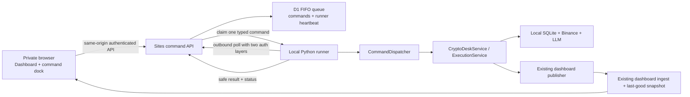

# Interactive CLI Dashboard Design

**Status:** Ready for user review  
**Date:** 2026-07-18  
**Scope:** Hosted private Sites UI with a local Crypto Desk command runner  
**Repositories:** Python source is in the root repository; the Sites application is the separate `web/` repository.

## 1. Context

The current dashboard is intentionally read-only:

- Python builds a sanitized `dashboard.v1` snapshot from local SQLite state.
- The publisher sends that snapshot to a protected Sites ingest route.
- Sites stores one last-good snapshot in D1.
- The browser polls `GET /api/dashboard` every 30 seconds.

This boundary keeps SQLite, Binance, LLM, Telegram, approval data, and credentials off the hosted site. It also means the hosted Cloudflare Worker cannot directly call the local `CryptoDeskService`.

The next version adds a CLI-like interaction surface without turning the browser into a shell or exposing a local inbound endpoint. Sites acts as the authenticated control plane and durable command queue. A single trusted Python runner connects outbound to Sites, claims one typed command at a time, and invokes local Python services.

## 2. Goals

- Preserve the current dashboard while adding a keyboard-first Hybrid command deck.
- Support research and operations commands:
  - `doctor`
  - `sync`
  - `screen`
  - `analyze <symbol>`
  - `daily`
  - `health`
  - `tickets`
  - `orders`
  - `reflections [symbol]`
- Support preview-and-confirm actions on Binance testnet:
  - `approve <ticket_id>`
  - `reject <ticket_id>`
  - `reconcile <ticket_id>`
- Process all commands through one global FIFO queue with no overlapping SQLite, LLM, or Binance work.
- Show durable command state as `QUEUED → RUNNING → SUCCEEDED/FAILED`, with `NEEDS_REVIEW` for uncertain recovery.
- Record the authenticated operator email for every command.
- Prevent duplicate execution across double-clicks, HTTP retries, browser reloads, process restarts, and lost result acknowledgements.
- Keep the dashboard readable when command execution is disabled or unavailable.

## 3. Non-goals

- Raw shell execution or arbitrary CLI flags.
- Mainnet approval, rejection, reconciliation, or order submission from the browser.
- Browser access to SQLite, artifact files, raw LLM output, raw broker responses, or secrets.
- Streaming stdout/stderr or live process logs.
- WebSocket, SSE, Durable Objects, or an inbound tunnel to the Crypto Desk host.
- Concurrent runners, per-user queues, priority scheduling, or command cancellation.
- Multi-role authorization in V1. Every authenticated user admitted by the private Sites access policy may submit commands.
- Historical portfolio analytics or replacement of the existing dashboard snapshot model.

## 4. Approved Product Decisions

- UI direction: Hybrid command deck. The existing dashboard remains the main context; a command dock and activity drawer provide interaction.
- Hosting topology: keep the private Sites deployment and add a local always-on outbound runner.
- Queue: one global FIFO queue; exactly one active command.
- Progress: durable states and sanitized final results, not streamed logs.
- Execution confirmation: show a server-generated preview, then execute after a single Confirm button click.
- Authorization: any authenticated user who can access the private site may submit commands.
- Audit identity: derive operator email from the trusted Sites identity header; never accept it from browser JSON.
- Runner idle poll interval: approximately 2 seconds.
- Runner offline threshold: 30 seconds without a valid heartbeat.
- Preview lifetime: 5 minutes, enforced by Sites at Confirm submission time.
- Command retention: 30 days.
- Clock authority: all time comparisons (heartbeat, lease, preview expiry, retention) use the Sites server clock. Runner and browser clocks are never authoritative.
- Mainnet: hard-disabled for all web-originated execution commands.

## 5. Architecture



### 5.1 Security boundaries

The browser boundary contains only:

- dashboard snapshots;
- typed command arguments;
- operator-visible previews;
- safe result objects;
- safe error codes;
- queue and heartbeat metadata.

The local host retains:

- config files and `.env`;
- Binance and LLM credentials;
- SQLite;
- report and artifact paths;
- raw evidence, raw LLM calls, and raw broker payloads;
- live execution secrets and Telegram proof material.

The runner makes outbound HTTPS requests only. No inbound port or tunnel is introduced.

### 5.2 Component boundaries

#### Sites application

- **Command contract:** defines command names, argument schemas, status values, safe result shapes, size limits, and forbidden keys.
- **User command API:** authenticates the Sites user, verifies CSRF and same-origin constraints, validates a typed request, applies idempotency/rate limits, and writes D1.
- **Runner API:** authenticates the machine runner, maintains its singleton session/heartbeat, atomically claims the oldest queued command, renews the active lease, and accepts terminal results.
- **Queue repository:** owns D1 statements and legal state transitions.
- **Command client hook:** submits commands, polls active/history state, survives browser reload, and triggers a dashboard refresh after relevant success.
- **Command dock:** parses only the approved grammar, provides history/autocomplete, and submits typed objects.
- **Activity drawer:** shows the active command, queued commands, last 50 terminal commands, and expandable safe results.
- **Execution preview dialog:** displays a runner-generated preview, traps focus, and issues an idempotent Confirm request.

The current monolithic `web/app/page.tsx` should be split only along these new responsibilities. Existing dashboard presentation components should not be redesigned beyond what is needed to embed the dock, runner status, activity drawer, and preview dialog.

#### Python application

- **Command models:** mirror the Sites command contract using Pydantic models with `extra="forbid"`.
- **CommandDispatcher:** maps a typed command to existing `CryptoDeskService`, `ExecutionService`, and store calls. It never invokes Typer, a subprocess, or a shell.
- **Safe result serializers:** return per-command result models and recursively reject forbidden keys (exact match, Section 6.2) before transport.
- **Local command journal:** records the remote command ID, canonical argument hash, lifecycle, and safe terminal result around local execution.
- **Command runner:** owns polling, singleton runner identity, heartbeat/lease renewal, dispatch, terminal reporting, and restart recovery.

CLI commands and the web runner must share the same dispatcher-level operations for the in-scope commands. Typer remains responsible only for CLI option parsing and terminal formatting.

## 6. Command Contract

The browser parser accepts a small grammar and produces a typed JSON object. It never forwards the original command string for execution.

| UI grammar | Typed arguments | Behavior |
|---|---|---|
| `doctor` | `{}` | Offline configuration and dependency checks only |
| `sync` | `{}` | Refresh local portfolio snapshot |
| `screen` | `{}` | Screen configured symbols |
| `analyze BTCUSDT` | `{"symbol":"BTCUSDT"}` | Analyze one configured symbol |
| `daily` | `{}` | Run the current daily bucket without catch-up |
| `health` | `{}` | Run the current health bucket |
| `tickets` | `{}` | Return sanitized tickets |
| `orders` | `{}` | Return sanitized submissions; no implicit reconciliation |
| `reflections` | `{"symbol":null}` | Return sanitized reflections |
| `reflections BTCUSDT` | `{"symbol":"BTCUSDT"}` | Return sanitized reflections for one configured symbol |
| `approve <ticket_id>` | Preview request first | Confirmed testnet approval |
| `reject <ticket_id>` | Preview request first | Confirmed testnet rejection |
| `reconcile <ticket_id>` | Preview request first | Confirmed testnet reconciliation |

V1 does not expose:

- `doctor --online`;
- `daily --catch-up` or `daily --due`;
- `health --due`;
- `orders --reconcile`;
- `live-code`;
- `publish-dashboard`;
- global `--config` or `--json`;
- unrecognized flags, pipes, redirects, quoting rules, environment expansion, or shell operators.

Dashboard publication remains automatic after successful state-changing commands.

### 6.1 Command envelope

Each D1 command contains:

- server-generated command UUID;
- command kind enum;
- canonical validated arguments;
- immutable authenticated operator email;
- fixed target environment `testnet`;
- unique idempotency key scoped to the operator;
- optional preview command ID;
- queued, started, lease, and terminal timestamps, all stamped by Sites;
- status;
- safe result or safe error code;
- bounded attempt/report metadata.

Browser requests must supply an idempotency key (a UUID generated once per user action) and never a command ID, operator identity, target environment, runner identity, status, or result. Requests without an idempotency key are rejected before enqueue.

### 6.2 Safe results

Each command kind has an explicit result schema. Generic stdout/stderr is not a result type.

Results must not contain any key from the forbidden list, matched exactly (case-insensitive) and checked recursively through nested objects and arrays. Substring/fragment matching is not used — it false-positives on legitimate keys (`raw` vs `drawdown`, `token` vs `token_count`). The initial forbidden list:

- `api_key`
- `api_secret`
- `token`
- `telegram`
- `actor`
- `confirmation`
- `report_dir`
- `client_order_id`
- `payload`
- `raw`
- `secret`

Command arguments are capped at 4 KiB after canonical JSON serialization. Safe results are capped at 32 KiB. Values exceeding bounds fail closed before D1 transport.

## 7. Queue and Persistence

### 7.1 D1 tables

#### `desk_commands`

Stores the current durable state for each command:

- identity and command envelope;
- status;
- runner lease metadata;
- preview reference;
- safe result/error;
- queued, started, terminal, and lease timestamps;
- safe terminal reason code.

The unique `(operator_email, idempotency_key)` constraint returns the existing command when the browser retries.

This row is also the audit record: operator email, every lifecycle timestamp, terminal status, and reason code live here. There is no separate append-only event table; per-transition history beyond these timestamps is not required for a single-runner queue with 30-day retention.

#### `desk_runner_state`

A singleton row contains:

- runner session ID;
- last heartbeat;
- active command ID;
- local execution mode (`TESTNET_ORDER` or `DRY_RUN`);
- safe runner state.

The UI considers the runner offline after 30 seconds without a valid heartbeat.

### 7.2 FIFO claim

The runner API atomically changes the oldest `QUEUED` command to `RUNNING`, ordered by `queued_at` and command ID, only when no other command is active.

A runner session is singleton. A second session cannot claim work while the current session holds an unexpired lease or an unresolved active command exists.

The API never changes an expired `RUNNING` command back to `QUEUED` — a possibly-started command is never re-executed automatically. Instead, when a `RUNNING` command's lease has been expired for longer than the runner-offline threshold, Sites moves it to `NEEDS_REVIEW` with reason `LEASE_EXPIRED`. This resolves the active command, so a permanently dead runner cannot wedge the queue: a new runner session can register and claim the next command. Runner restart recovery must still resolve the active local journal record first (Section 8).

### 7.3 State machine

```text
QUEUED → RUNNING → SUCCEEDED
                 → FAILED
                 → NEEDS_REVIEW
```

Legal transitions are enforced in the queue repository. Terminal states cannot return to `QUEUED` or `RUNNING`.

`RUNNING → NEEDS_REVIEW` is set by the runner (uncertain local execution) or by Sites (lease expired past the runner-offline threshold, reason `LEASE_EXPIRED`).

`NEEDS_REVIEW` means local execution may have crossed a side-effect boundary and must not be repeated automatically. The operator can inspect the safe context and issue a new `reconcile` flow. A late terminal report from a runner for a command already in `NEEDS_REVIEW` is recorded in the local journal but does not change the terminal state.

## 8. Local Command Journal and Exactly-Once Effects

D1 idempotency prevents duplicate queue records but cannot by itself prove that a local effect occurred exactly once. Before dispatch, the runner writes a local journal row containing:

- remote command ID;
- canonical command hash;
- command kind;
- local state;
- safe terminal result when known;
- timestamps.

Recovery rules:

- Unknown command ID: create a journal row before calling the dispatcher.
- Same ID and same hash in `SUCCEEDED` or `FAILED`: report the stored terminal state without executing again.
- Same ID with a different hash: fail closed as a command integrity error.
- Journal state `RUNNING` after a process restart:
  - non-execution commands are not automatically repeated;
  - execution commands become `NEEDS_REVIEW`;
  - the runner resolves or reports the record before claiming new work.
- Terminal local result not acknowledged by Sites: retry only the result-report request using the same command ID.

Existing `ExecutionService` safeguards remain authoritative, including ticket status/TTL checks, symbol/environment checks, risk revalidation, quote deviation checks, duplicate submission checks, and reconciliation behavior.

## 9. Execution Preview and Confirm

`approve`, `reject`, and `reconcile` are two-phase flows.

1. The browser submits a typed preview request with action and ticket ID.
2. The preview enters the same global FIFO queue.
3. The runner reads current local state and returns a sanitized preview.
4. The UI displays:
   - shortened and full copyable ticket ID;
   - environment;
   - execution mode;
   - status;
   - symbol;
   - side and intent;
   - quantity;
   - notional;
   - entry, stop, and target where applicable;
   - creation and expiration time;
   - current submission state for reconciliation.
5. The preview result contains a canonical ticket fingerprint. The preview expires 5 minutes after Sites records the preview result, measured on the Sites clock.
6. Sites enforces expiry at Confirm submission: a confirm request for an expired preview is rejected with `PREVIEW_EXPIRED` and no execution command is created. Expiry is not re-checked later, so time spent waiting in the FIFO queue behind a long command cannot expire an already-accepted confirm; staleness after acceptance is caught by fingerprint revalidation instead.
7. Confirm creates one idempotent execution command referencing the preview ID.
8. The confirming email must equal the preview operator email.
9. The runner rereads local state and validates the preview fingerprint, ticket status, TTL, environment, current account, quote, and risk constraints.
10. Any mismatch fails closed with `TICKET_CHANGED` or a more specific safe validation code.
11. Only then does the dispatcher call the relevant `ExecutionService` method.

The preview clearly labels:

- `TESTNET ORDER` when `TESTNET_EXECUTION_ENABLED=1`;
- `DRY RUN` when testnet execution is disabled.

No confirm request can select mainnet. The runner rejects execution unless local config, `BINANCE_ENV`, broker environment, ticket environment, and command target are all testnet.

## 10. Runner Protocol

The local runner uses:

- `OAI-Sites-Authorization: Bearer <Sites bypass token>`;
- `Authorization: Bearer <runner token>`.

The runner token is independent from the existing dashboard ingest token. Both runner credentials remain local and hosted runtime secrets; neither is committed or returned to the browser.

The runner:

1. registers or resumes its singleton session;
2. heartbeats every 5 seconds;
3. polls for work approximately every 2 seconds while idle;
4. claims one command;
5. writes the local journal entry;
6. renews a 30-second command lease every 10 seconds while running;
7. dispatches the typed command;
8. stores the safe terminal result locally;
9. reports the terminal result with conditional state/lease checks;
10. publishes a new dashboard snapshot after successful state-changing operations;
11. claims the next FIFO command.

The runner does not execute a second command while result delivery or recovery for the previous command is unresolved.

## 11. Web API Surface

The design requires these logical endpoints; exact route filenames are an implementation-plan concern.

### User-facing

- `GET /api/command-session`
  - returns authenticated operator identity, CSRF nonce, runner state, and feature availability;
- `POST /api/commands`
  - creates non-execution commands with idempotency;
- `POST /api/command-previews`
  - creates preview commands;
- `POST /api/command-previews/{id}/confirm`
  - creates one confirmed execution command;
- `GET /api/commands?limit=50`
  - returns the active queue and recent terminal history;
- `GET /api/commands/{id}`
  - restores one command after reload.

### Runner-facing

- register/resume runner session;
- heartbeat;
- claim next FIFO command;
- renew active lease;
- report success;
- report failure or needs-review.

Runner routes require both machine authentication layers and never accept browser cookies as authorization.

## 12. Authentication, CSRF, and Abuse Controls

The private Sites access policy is the authorization boundary chosen for V1. Every user admitted by that policy may submit commands.

Write routes additionally require:

- `oai-authenticated-user-email`;
- exact same-origin `Origin`;
- an application-issued short-lived CSRF nonce bound to the email;
- `Content-Type: application/json`;
- a valid command schema;
- request body within size limits.

The API rejects client-supplied identity and records the trusted header value.

Limits:

- at most 10 non-terminal commands per operator;
- at most 100 non-terminal commands globally;
- bounded command history query of 50 rows;
- 30-day command retention;
- opportunistic bounded cleanup rather than unbounded delete work in a user request.

## 13. UI and Interaction

### 13.1 Command dock

- Remains visible within the dashboard workspace.
- Uses `desk ›` visual syntax.
- Supports Up/Down command history, Tab autocomplete, Enter submit/preview, and Escape clear.
- Autocomplete contains only approved commands and configured symbols.
- Pressing Enter queues research/operations commands immediately.
- Pressing Enter for execution commands starts a preview, not execution.
- Command input is disabled when:
  - the feature flag is off;
  - the runner heartbeat is older than 30 seconds;
  - session/CSRF initialization failed;
  - queue or per-user limits are reached.

### 13.2 Activity drawer

- Shows the active command, FIFO position for queued commands, and last 50 terminal commands.
- Shows operator, timestamps, duration, status, and an expandable safe result.
- Restores state from D1 after browser reload.
- Uses separate indicators for dashboard freshness and runner availability.
- Refreshes `GET /api/dashboard` immediately after a state-changing command succeeds, while retaining the existing 30-second background polling.

### 13.3 Preview dialog

- Shows exact safe ticket details and preview expiry.
- Uses explicit Cancel and action-specific Confirm labels.
- Traps focus while open and restores focus to the command dock when closed.
- Disables Confirm after the first accepted click.
- Announces status changes with `aria-live`.
- Uses text in addition to color for environment, execution mode, and risk state.

### 13.4 Offline behavior

When the runner is offline, the dashboard and command history remain readable. New command submission is disabled so commands cannot execute unexpectedly when a machine returns hours later.

## 14. Error Handling and Recovery

The browser receives stable safe codes and application-owned copy.

| Condition | Command/API outcome |
|---|---|
| Invalid syntax or arguments | Reject before enqueue |
| Missing identity or invalid CSRF | `401`/`403`; no enqueue |
| Runner offline | `RUNNER_OFFLINE`; no enqueue |
| User/global queue limit | `429`; no enqueue |
| Duplicate idempotency key | Return original command |
| Missing idempotency key | Reject before enqueue |
| Preview expired at Confirm submission | `PREVIEW_EXPIRED`; no enqueue |
| Ticket changed | `FAILED: TICKET_CHANGED` |
| `RUNNING` lease expired past runner-offline threshold | `NEEDS_REVIEW: LEASE_EXPIRED`; queue unblocked for a new runner session |
| Mainnet or environment mismatch | `FAILED: ENVIRONMENT_FORBIDDEN` |
| Failure before a possible side effect | `FAILED` with a safe category |
| Possible broker side effect with uncertain acknowledgement | `NEEDS_REVIEW: EXECUTION_UNCERTAIN` |
| D1 unavailable | No new execution; dashboard last-good behavior remains independent |
| Browser/network interruption | Recover by command ID |

Exceptions, request bodies, secret-bearing URLs, report paths, raw broker/LLM responses, stdout, and stderr never appear in API errors or D1 rows.

## 15. Feature Flags and Kill Switches

- Hosted `CRYPTO_DESK_COMMAND_UI_ENABLED=0`:
  - rejects new user commands;
  - leaves dashboard, runner status, and history readable.
- Local `CRYPTO_DESK_COMMAND_RUNNER_ENABLED=0`:
  - prevents the runner from claiming new commands;
  - allows explicit recovery/reporting of an already journaled command before shutdown.

Mainnet web execution is not a feature flag. It is absent from the command contract and rejected by hard validation.

## 16. Testing Strategy

### 16.1 Python

- Pydantic command and result schema tests.
- Parser/dispatcher mapping tests.
- Contract tests proving CLI and web dispatcher parity for in-scope operations.
- Recursive secret/forbidden-key tests for every result schema.
- Local journal tests:
  - first execution;
  - duplicate ID/same hash;
  - duplicate ID/different hash;
  - terminal result replay;
  - restart from `RUNNING`;
  - result-report retry.
- Mainnet hard-lock tests at command, runner, dispatcher, ticket, broker, and settings boundaries.
- Preview fingerprint/operator tests (preview expiry itself is enforced and tested on the Sites side).
- `approve`, `reject`, and `reconcile` tests with fake brokers, including ambiguous submission and `NEEDS_REVIEW`.
- Runner protocol tests with `httpx.MockTransport`.

### 16.2 Web API and D1

- Missing identity, invalid origin, invalid CSRF, wrong content type, oversized body, and invalid schema tests.
- Idempotency and per-user/global limit tests.
- Atomic FIFO claim test with concurrent claim attempts.
- Singleton runner session and heartbeat tests.
- Legal and illegal state transition tests.
- Lease renewal and unresolved active command tests.
- Lease-expiry tests: expired `RUNNING` command becomes `NEEDS_REVIEW: LEASE_EXPIRED`, is never requeued, and a new runner session can then claim work.
- Preview creation/confirm identity tests, and expiry enforced at Confirm submission time on the Sites clock.
- Result cap and recursive forbidden-key tests.
- Retention cleanup tests.
- Backward-compatible dashboard API tests.

### 16.3 Browser UI

Pure Node tests cover parser, autocomplete, reducers, status formatting, reload-recovery state, and runner-offline disabling logic. Add Playwright as a development-only dependency for the money-path interactions only:

- double-click Confirm idempotency;
- preview focus trap and focus restoration;
- visible execution mode (`TESTNET ORDER` vs `DRY RUN`) in the preview dialog.

Remaining UI behavior is covered by the Node tests; expand Playwright coverage only if those prove insufficient.

Tests use fake Worker/D1/runner responses and never real trading credentials.

## 17. Rollout

1. Add D1 schema and command APIs with the hosted UI feature flag disabled.
2. Add Python models, dispatcher, local journal, and runner with execution disabled.
3. Deploy and canary read commands.
4. Enable `sync`, `screen`, `analyze`, `daily`, and `health`.
5. Enable execution preview and Confirm in `DRY RUN`.
6. Verify audit, idempotency, restart recovery, lease behavior, and secret scans.
7. Enable actual Binance testnet execution.
8. Keep the existing read-only dashboard version available as the deployment rollback target.

Root and `web/` changes are committed and verified separately. No deployment occurs until both repositories pass their complete test suites and the hosted/runtime secrets are configured without appearing in tracked files or logs.

## 18. Acceptance Criteria

- An authenticated private-site user can submit every approved command from the Hybrid command deck.
- An online idle runner claims a command within 5 seconds.
- Commands execute globally in FIFO order with no overlap.
- Browser reload retains active and terminal command state.
- Execution actions require a fresh preview and one Confirm click.
- Double-click or HTTP retry creates at most one local effect.
- An expired preview is rejected at Confirm submission; a changed ticket fails closed at execution.
- Runner restart never automatically repeats a command left `RUNNING`.
- A permanently dead runner cannot wedge the queue: lease expiry moves the active command to `NEEDS_REVIEW` and a new runner session can claim work.
- Uncertain execution becomes `NEEDS_REVIEW`, not an automatic retry.
- Testnet execution uses the authenticated email as the immutable audit actor.
- All web-originated mainnet execution attempts fail closed.
- D1 and browser data contain no forbidden secret, approval, artifact, or raw payload fields.
- Runner-offline state disables submission while keeping dashboard/history readable.
- Existing last-good dashboard polling behavior remains functional when the command system is disabled.
- Python pytest/Ruff, web build/API tests, and Playwright interaction tests pass before deployment.

## 19. Explicitly Deferred

- Mainnet browser execution.
- Role-based access control.
- Command cancellation or priority.
- Multiple runners or per-user queues.
- Streaming logs or incremental LLM output.
- WebSocket/SSE/Durable Objects.
- Raw report/artifact download.
- Online doctor flags and scheduler catch-up flags.
- Arbitrary CLI parity or a general-purpose terminal emulator.
